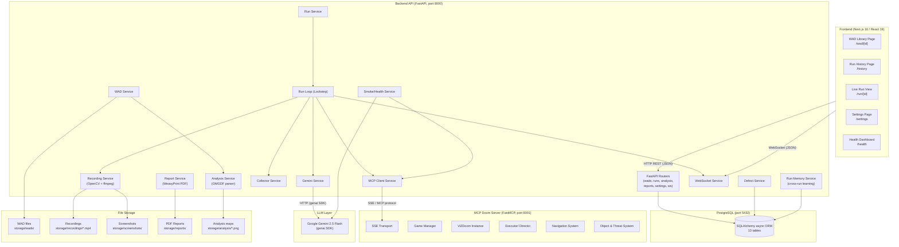
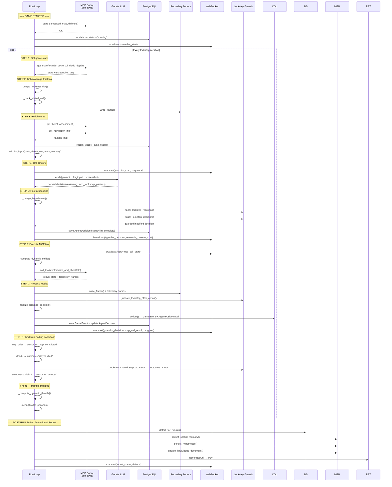
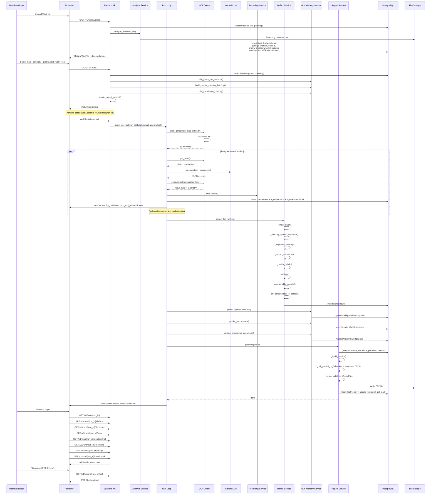
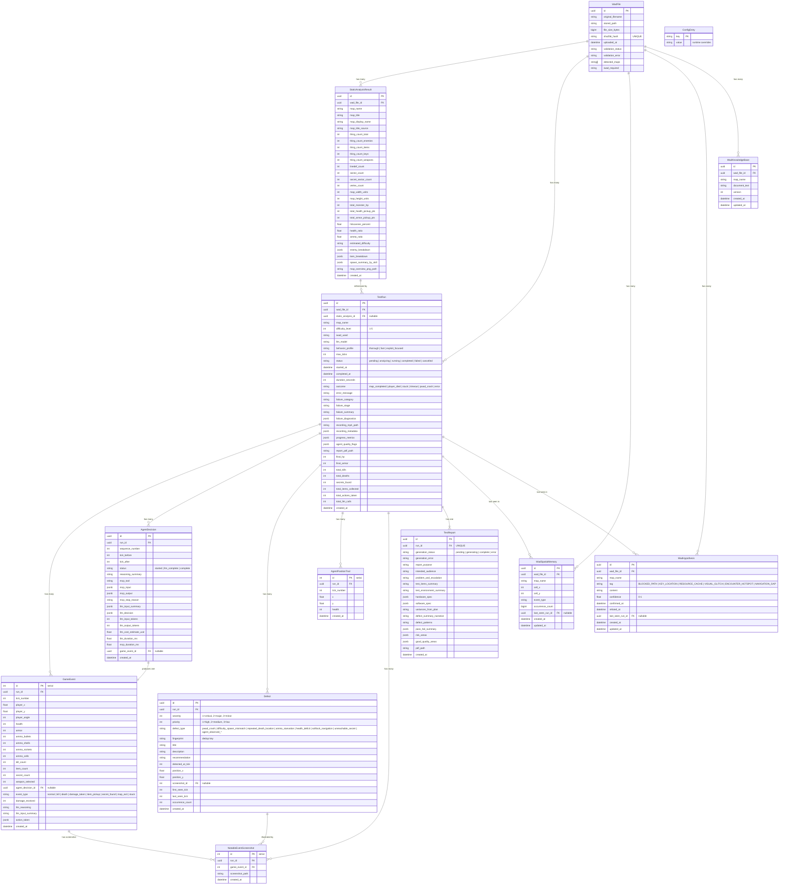

# Agentic PWAD QA for Doom — System Architecture

## Overview

Agentic PWAD QA for Doom is an autonomous quality assurance system that takes custom Doom WAD files as input and produces professional QA reports. It uses Google Gemini 2.5 Flash as an AI agent to play through maps via ViZDoom, controlled through the Model Context Protocol (MCP). Every tick of gameplay, every LLM decision, and every MCP tool call is recorded, analyzed for defects, and compiled into a PDF report.

---

## 1. High-Level System Architecture



### Component Descriptions

| Component | Technology | Role |
|---|---|---|
| **Frontend** | Next.js 16 (React 19) | Dashboard UI for uploading WADs, viewing run history, monitoring live runs, adjusting settings |
| **Backend API** | FastAPI (Python) | REST API + WebSocket server; orchestrates all QA run lifecycle |
| **PostgreSQL** | SQLAlchemy async | Persistent storage for all entities (WADs, runs, events, decisions, defects, reports, memory) |
| **MCP Doom Server** | FastMCP (Python) | Wraps ViZDoom as MCP tools; exposes game state, actions, and compound behaviors |
| **Gemini LLM** | Google Gemini 2.5 Flash | Decision-making agent; receives game state + screen capture, returns structured JSON decisions |
| **Recording Service** | OpenCV + ffmpeg | Captures gameplay frames into MP4 video with H.264 transcoding |

### Communication Protocols

- **Frontend ↔ Backend**: REST/JSON over HTTP (port 8000) for CRUD operations; WebSocket (port 8000) for live run streaming
- **Backend ↔ MCP Doom**: MCP protocol over SSE (Server-Sent Events) at `http://localhost:8001/sse`; `fastmcp` Python client library
- **Backend ↔ Gemini**: HTTPS using `google-genai` Python SDK (REST API)

---

## 2. Lockstep AI Loop

The lockstep AI loop is the core gameplay cycle. The game is **paused** between LLM decisions — the agent must think, decide, and execute before the game advances.



### Lockstep State Machine

The `LockstepState` dict tracks per-run progress:

| Field | Purpose |
|---|---|
| `visited_cells` | Set of `(cx,cy)` cells visited for coverage tracking |
| `total_map_cells_estimate` | Pre-computed from static analysis |
| `completed_object_ids` | Map of object IDs successfully reached/collected |
| `failed_object_ids` | Map of object IDs that failed repeatedly |
| `out_of_ammo_targets` | Combat targets where ammo ran out |
| `action_signature_counts` | Recent action signatures to detect loops |
| `low_value_explore_total` | Count of explores that consumed budget without progress |
| `should_stop_stuck` | Flag set when lockstep recovery is exhausted |
| `progress_score` | Cumulative progress metric (arrivals, kills) |
| `hypotheses` | LLM-generated hypotheses about map issues |

### Behavior Profiles

Runs support different behavior profiles that tune the lockstep loop:

| Profile | Default Stride | Description |
|---|---|---|
| **thorough** | 60 tics | Conservative exploration; pauses to analyze frequently |
| **fast** | 150 tics | Optimizes for speed; longer explore actions between decisions |
| **exploit_focused** | 40 tics | Aggressively probes for edge cases and softlocks |

Profiles are stored in `Backend/app/core/behavior_profiles.py` and loaded per-run.

---

## 3. Data Flow for a Test Run



### Run Outcomes

| Outcome | Meaning |
|---|---|
| `map_completed` | Agent reached the exit (level_completed or next_map) |
| `player_died` | Agent health dropped to 0 |
| `stuck` | Lockstep system detected no progress across repeated decisions |
| `timeout` | Episode timeout or max_ticks exceeded |
| `cancelled` | User manually cancelled via API |
| `pwad_crash` | WAD failed to initialize in ViZDoom |
| `error` | Infrastructure or tool error (MCP connect failure, timeout) |

### WebSocket Event Types

During a live run, the frontend receives these WebSocket messages:

| Type | When | Payload |
|---|---|---|
| `state` | Run start | Status + tick |
| `llm_start` | Before Gemini call | sequence_number, tick |
| `llm_decision` | After Gemini response | reasoning, mcp_tool, tokens, cost |
| `mcp_call_start` | Before MCP execution | tool, params |
| `mcp_call_result` | After MCP execution | stop_reason, duration |
| `progress` | After each action | coverage, score, metrics |
| `frame` | At live_frame_fps rate | JPEG base64 screenshot |
| `event` | On notable events | event type + reasoning |
| `defect` | After detection | defect_type, severity |
| `report_status` | Report generation | status (generating/complete/error) |
| `quality_summary` | Run end | progress_metrics, quality_flags |
| `recording_status` | Recording finalized | metadata, warnings |
| `status` | During throttle | phase, sleep_seconds |

---

## 4. Database Entity Relationships



### Key Indexes

| Table | Index | Columns |
|---|---|---|
| `test_runs` | Primary lookup | `wad_file_id`, `status`, `created_at DESC` |
| `test_runs` | Map history | `(wad_file_id, map_name, created_at DESC)` |
| `game_events` | Run trace | `(run_id, tick_number)` |
| `wad_spatial_memory` | Cell lookup | `(wad_file_id, map_name)` |
| `wad_hypotheses` | Tag search | `(wad_file_id, map_name, tag)` |
| `agent_decisions` | Run decisions | `(run_id, sequence_number)` |

---

## 5. Key Subsystems

### 5.1 WAD Analysis Service (`Backend/app/services/analysis_service.py`)

Uses the `omg` library to parse WAD files at the binary level. For each map, it extracts:
- **Thing counts** by type (enemies, items, keys, weapons) with Doom-format spawn rules
- **Map geometry** (linedefs, sectors, vertices, bounds)
- **Secret sectors** (sector type 9)
- **Feature detection** (doors, locked doors, lifts, teleporters, key requirements)
- **Difficulty estimates** based on enemy count, hitscanner percentage, health/ammo ratios
- **Skill spawn analysis** — determines which things spawn at each difficulty level (1-5) considering skill flags and multiplayer flags

Output stored in `StaticAnalysisResult` with per-skill spawn summaries in `spawn_summary_by_skill` JSONB column.

### 5.2 MCP Doom Server (`mcp-doom/src/doom_mcp/`)

A FastMCP server exposing ViZDoom through MCP tools over SSE transport. Key tools:

| Tool | Type | Description |
|---|---|---|
| `start_game` | Control | Initialize ViZDoom with WAD/map/scenario |
| `get_state` | Observation | Full game state + screenshot PNG (sectors optional) |
| `take_action` | Atomic action | Execute raw button presses for N tics |
| `explore` | Compound | Autonomous exploration with wall avoidance |
| `aim_and_shoot` | Compound | Aim + fire at target |
| `strafe_and_shoot` | Compound | Strafe + fire (hitscan dodge) |
| `move_to` | Compound | Pathfind to object |
| `retreat` | Compound | Turn and run / backpedal |
| `get_threat_assessment` | Context | Tactical threat analysis |
| `get_navigation_info` | Context | Exploration grid + door tracking |
| `get_situation_report` | Context | Executor state summary (async mode) |
| `set_objective` | Director | Assign goals to autonomous executor |
| `set_strategy` | Director | Tune executor behavior parameters |

Compound actions (`explore`, `aim_and_shoot`, etc.) run many game tics internally (sub-millisecond simulation) and return telemetry frames at configurable strides. This avoids round-trip latency for every game tic.

The server supports two modes:
- **SYNC_PLAYER** (default): Game pauses between `take_action` calls — each action is an atomic decision
- **ASYNC_PLAYER** (optional): Game runs continuously at 35 Hz; agent uses `set_objective`/`set_strategy` to guide an autonomous executor

### 5.3 Gemini Service (`Backend/app/services/gemini_service.py`)

Wraps the `google-genai` SDK with:

- **Rate limiting**: Semaphore-based concurrency control + sliding window rate limiter (calls/minute)
- **Retry logic**: 3 attempts with exponential backoff; rate-limit-aware retry delays
- **JSON extraction**: Multiple strategies to extract valid JSON from LLM text output (code blocks, balanced braces, last-resort brace find)
- **Decision parsing**: Validates tool names against allowed set, normalizes parameters
- **Deterministic fallback**: When Gemini is unavailable/key is missing/rate limited, a rule-based `_fallback_decision()` picks targets based on visible monsters > visible pickups > weapon switch > USE interaction > unexplored direction > turn-and-retreat
- **Cost tracking**: Token usage is captured per-call and stored in `AgentDecision` rows

The system prompt is rendered from `Backend/app/prompts/agent_system_prompt.md` with static analysis data, cross-run memory, spatial memory briefing, and knowledge document injected as template variables.

### 5.4 Recording Service (`Backend/app/services/recording_service.py`)

- Captures gameplay frames as OpenCV `ndarray` → writes to `.source.mp4` (MP4V codec)
- Transcodes to H.264 with `ffmpeg` for browser-compatible output
- Frame deduplication via perceptual hashing (blake2b of 64×48 thumbnail)
- Tick-aware frame skipping to maintain target FPS
- Validation checks: frame count vs expected (based on game tics), unique frame ratio, minimum duration, resolution
- `save_screenshot()`: Captures individual frames for notable events (PNG, linked to `NotableEventScreenshot` table)

### 5.5 Defect Detection (`Backend/app/services/defect_service.py`)

Runs after each completed run, detecting:

| Defect Type | Detection Logic | Severity |
|---|---|---|
| `pwad_crash` | Run outcome is `pwad_crash` | 1 (Critical) |
| `difficulty_spawn_mismatch` | Skill flags hide enemies/items at chosen difficulty | 2-3 |
| `repeated_death_location` | Multiple deaths within 50-unit area | 2 |
| `ammo_starvation` | Zero ammo for 60+ consecutive ticks | 2 |
| `health_deficit` | HP below 10 for 30+ consecutive ticks | 3 |
| `softlock_navigation` | Repeated stuck events or timeout with <20 unit movement in final 30 events | 1 |
| `unreachable_secret` | Secret sectors exist but none found at >60% coverage | 3 |
| `agent_observed_*` | LLM self-reported issue via `observed_issue` field | 2 |

Defects also link to `NotableEventScreenshot` records for visual evidence in reports.

### 5.6 Cross-Run Memory System (`Backend/app/services/run_memory.py`)

Persists knowledge across multiple runs of the same WAD/map:

| Table | Purpose |
|---|---|
| `WadSpatialMemory` | Grid-cell-level event history (stuck cells, death cells, key locations, secret locations, resource starvation) — aggregated with occurrence counts |
| `WadHypothesis` | Persistent tags about map issues (BLOCKED_PATH, KEY_LOCATION, RESOURCE_CACHE, etc.) with confidence scores that increase with repeated observation |
| `WadKnowledgeBase` | Accumulated free-text document about a map, updated after each run with outcome, duration, defects |

On run start, these are queried and injected into the LLM prompt as structured context. This enables the agent to learn from previous runs: e.g., "avoid the north corridor, the last 3 runs got stuck there."

### 5.7 Report Generation (`Backend/app/services/report_service.py`)

Generates professional PDF QA reports using the UK Ministry of Defence DEF STAN 00-055 format:

1. **Data aggregation**: Queries all events, decisions, positions, defects for the run
2. **Metrics computation**: Event counts, movement distance, action distribution, coverage percentage, kill ratios, health/ammo ratios
3. **Gemini enhancement**: Sends compact run data to Gemini for narrative generation (falls back to deterministic template if unavailable)
4. **PDF rendering**: Uses `WeasyPrint` with `jinja2` HTML templates → PDF
5. **Storage**: PDF saved to filesystem; path stored in `TestReport` and `TestRun.report_pdf_path`

Report sections include: report purpose, test environment, hardware/software specs, pass/fail summary (navigation, combat, resources, secrets), defect summary, risk areas, and decision trace appendix.

---

## 6. API Endpoints

### WAD Management (`/v1/wads`)

| Method | Path | Description |
|---|---|---|
| POST | `/wads/upload` | Upload a WAD file (multipart) |
| GET | `/wads` | List all WADs |
| GET | `/wads/{id}` | Get WAD details |
| DELETE | `/wads/{id}` | Delete WAD + cascade |
| POST | `/wads/{id}/reanalyze` | Re-run static analysis |
| GET | `/wads/{id}/maps` | List maps in WAD |
| GET | `/wads/{id}/map-png?map_name=` | Get overview PNG |
| GET | `/wads/maps` | All maps across WADs |

### Run Management (`/v1/runs`)

| Method | Path | Description |
|---|---|---|
| POST | `/runs` | Create and start a test run |
| GET | `/runs` | List runs (filterable by wad, map, outcome, status, difficulty, date range) |
| GET | `/runs/{id}` | Get run details |
| DELETE | `/runs/{id}` | Cancel run |
| POST | `/runs/{id}/force-stop` | Force-stop run |
| PATCH | `/runs/{id}/behavior` | Change behavior profile mid-run |
| GET | `/runs/compare?run_a=&run_b=` | Side-by-side run comparison |

### Trace & Telemetry (`/v1/runs/{id}`)

| Method | Path | Description |
|---|---|---|
| GET | `/runs/{id}/trace` | Full ordered GameEvent trace (paginated) |
| GET | `/runs/{id}/events` | Filtered notable events |
| GET | `/runs/{id}/decisions` | LLM/MCP decision trace (paginated) |
| GET | `/runs/{id}/defects` | Detected defects |
| GET | `/runs/{id}/position-trail` | Position samples |
| GET | `/runs/{id}/recording` | MP4 video download |
| GET | `/runs/{id}/usage` | Token/cost summary |
| GET | `/runs/{id}/benchmark` | Latency breakdown |

### Reports (`/v1/reports`)

| Method | Path | Description |
|---|---|---|
| GET | `/reports/{run_id}/pdf` | Download PDF report |

### Health (`/v1/health`)

| Method | Path | Description |
|---|---|---|
| GET | `/health` | Basic health check |
| GET | `/health/gemini` | Gemini API probe |
| GET | `/health/mcp` | MCP SSE reachability |
| GET | `/health/smoke` | Full end-to-end smoke test |
| GET | `/health/detailed` | All dependencies + storage + active runs |

### WebSocket

| Path | Description |
|---|---|
| `/v1/ws/runs/{run_id}` | Live run stream (decision events, frames, progress) |

---

## 7. File Layout

```
Agentic-PWAD-QA-Doom/
├── Backend/
│   ├── app/
│   │   ├── main.py                    # FastAPI app entry point, lifespan, health checks
│   │   ├── core/
│   │   │   ├── config.py              # Settings (pydantic-settings)
│   │   │   ├── database.py            # SQLAlchemy async engine + session
│   │   │   ├── types.py               # LockstepState type alias
│   │   │   ├── behavior_profiles.py   # Profile definitions
│   │   │   └── metrics.py             # Prometheus metrics
│   │   ├── models/                    # SQLAlchemy ORM models (13 tables)
│   │   ├── repositories/              # Data access layer (8 repositories)
│   │   ├── routers/                   # FastAPI route handlers (7 routers)
│   │   ├── serializers/               # Pydantic response models
│   │   ├── services/                  # Business logic (19 services)
│   │   └── prompts/                   # LLM system prompt templates
│   ├── migrations/                    # Alembic migrations
│   └── tests/                         # Pytest test suite
├── mcp-doom/
│   └── src/doom_mcp/
│       ├── server.py                  # FastMCP server definition (18 tools)
│       ├── game_manager.py            # ViZDoom lifecycle + state management
│       ├── game_setup.py              # ViZDoom config builder
│       ├── actions.py                 # Action execution (take_action)
│       ├── state.py                   # State extraction + normalization
│       ├── objects.py                 # Game object enrichment DB
│       ├── scenarios.py               # Built-in scenario definitions
│       ├── navigation.py              # Grid-based exploration + stuck recovery
│       └── executor.py                # Autonomous director executor
├── frontend/
│   ├── app/                           # Next.js App Router pages
│   ├── components/                    # React components
│   ├── hooks/                         # Custom hooks (useRunStream)
│   └── lib/                           # API client, types, utilities
└── docs/
    └── architecture.md                # This document
```
