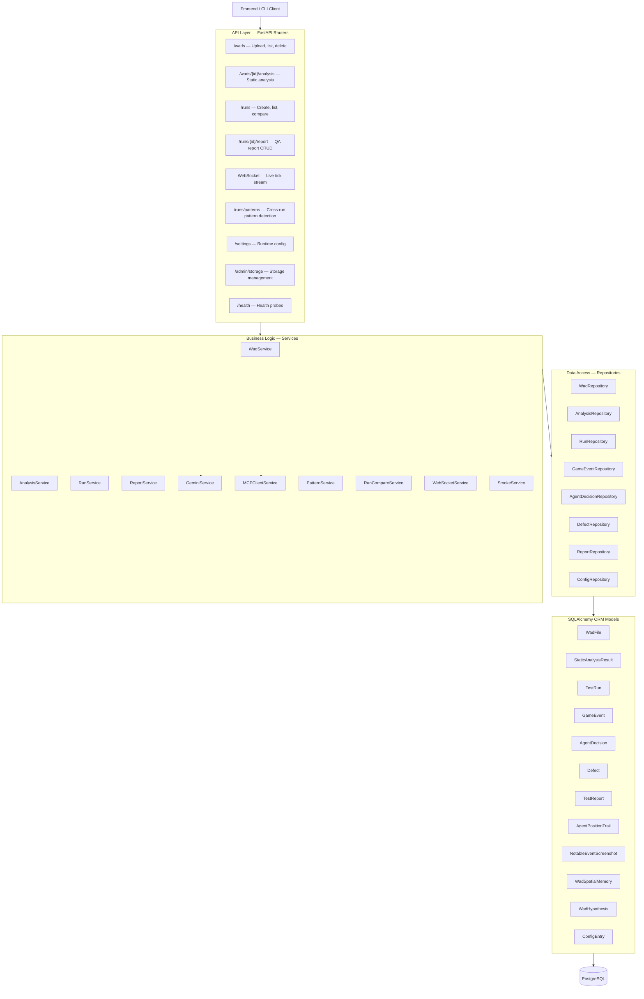

# Backend — Agentic PWAD QA for Doom

## Overview

The backend is a real-time asynchronous FastAPI server that orchestrates autonomous LLM-driven playthroughs of custom Doom PWAD (Patch WAD) files. It ingests a PWAD, performs static map analysis, dispatches an AI agent to play through each map, records every tick of gameplay, surfaces defects, and generates a structured QA report — all via a clean HTTP API with live WebSocket streaming.

## Tech Stack

| Component          | Technology                                      |
|--------------------|-------------------------------------------------|
| Framework          | FastAPI 0.136 + Uvicorn                         |
| ORM                | SQLAlchemy 2.0 (async, `asyncpg` driver)        |
| Database           | PostgreSQL 16                                   |
| Migrations         | Alembic 1.18                                    |
| Validation         | Pydantic 2 / Pydantic-Settings                  |
| LLM                | Google Gemini 2.5 Flash (via `google-genai`)    |
| MCP Client         | `fastmcp` — connects to Doom environment        |
| Metrics            | Prometheus client (`prometheus_client`)          |
| Error Tracking     | Sentry SDK                                      |
| PDF Generation     | WeasyPrint + Jinja2                             |
| Video Recording    | OpenCV + ffmpeg-python                          |
| Testing            | pytest + pytest-asyncio                         |

## Layered Architecture



### Layer Descriptions

1. **Routes** — Thin HTTP/WebSocket handlers that validate input (query params, path params, request bodies) and delegate to services. Registered under `/v1/*`.

2. **Services** — Stateless business logic classes instantiated with a `db: AsyncSession`. Orchestrate operations: WAD validation + storage, map analysis (via Omgifol + Gemini), run loop (MCP → Doom → Gemini → MCP), report generation (Jinja2 → WeasyPrint PDF), cross-run pattern aggregation, and run comparison.

3. **Repositories** — Data access layer wrapping SQLAlchemy async queries. Each repository handles CRUD for its model and encapsulates query logic (filtering, pagination, aggregation).

4. **Models** — SQLAlchemy 2.0 declarative ORM mappings with `Mapped` / `mapped_column` syntax, composite indexes, foreign keys, check constraints, and relationship navigation.

5. **PostgreSQL** — The backing store for all persistent state. Async connections via `asyncpg`.

## Key Design Decisions

- **Async end-to-end**: FastAPI async handlers, SQLAlchemy async sessions, async Gemini SDK, async MCP SSE transport — no thread pool blocking.
- **Layered separation**: Routers never call repositories directly; services sit between to compose multi-repository workflows and run background tasks.
- **Run loop as state machine**: `TestRun.status` transitions through `pending → running → completed | failed | cancelled`. The `RunService.cancel()` method is safe to call at any point.
- **Behaviour profiles**: Three canned agent personalities (`thorough`, `fast`, `exploit_focused`) control throttle delays and the LLM system prompt. Recording stride is configured independently.
- **Reviewer analytics**: `WadSpatialMemory`, `WadHypothesis`, outcome counts,
  and recurring defects remain available for reviewers without influencing
  future agent actions.
- **Prometheus instrumentation**: Counters for runs, LLM calls, MCP calls, and defects; histograms for LLM/MCP latency; active-run gauge. Exposed at `/metrics`.
- **Sentry integration**: Automatic error capture with 0.1 trace sample rate when `SENTRY_DSN` is set.

## Project Layout

```
Backend/
├── app/
│   ├── main.py               # FastAPI app factory, lifespan, health routes
│   ├── core/
│   │   ├── config.py         # Pydantic-settings (env → Settings)
│   │   ├── database.py       # Async engine, session factory, Base
│   │   ├── metrics.py        # Prometheus metric definitions
│   │   ├── behavior_profiles.py  # Agent personality configs
│   │   └── types.py          # Shared type aliases
│   ├── models/               # 13 SQLAlchemy ORM models
│   ├── repositories/         # DB query layer per model
│   ├── services/             # Business logic layer
│   ├── serializers/          # Pydantic request/response models
│   └── routers/              # 10 route modules
├── migrations/               # Alembic versioned migrations (12 revisions)
├── tests/                    # pytest suite (28 test files)
├── storage/                  # WAD files, recordings, screenshots, reports
└── scripts/                  # init_db.sh and helpers
```

## Further Reading

| Document | Description |
|----------|-------------|
| [API Reference](api.md) | All 42 HTTP/WS endpoints with methods and descriptions |
| [Data Model](data-model.md) | 11 core record models and evidence semantics |
| [Full Models](models.md) | All 13 SQLAlchemy ORM models with field types and constraints |
| [Routers](routers.md) | All 10 API routers with endpoint details |
| [Services](services.md) | Services catalog: active runtime, evidence, analytics |
| [Services Detail](services-detail.md) | In-depth service documentation |
| [Prompts](prompts.md) | LLM prompt templates and engineering details |
| [Run Lifecycle](run-lifecycle.md) | Lockstep loop: creation, iteration, completion |
| [Defect Detection](defect-detection.md) | 7 post-run detectors and fingerprinting |
| [Migrations](migrations.md) | Alembic migration history and schema evolution |
