# API Reference — Agentic PWAD QA for Doom

Base path: `/v1`

All endpoints listed below. Responses are JSON unless otherwise noted.

---

## Endpoint Tree

```mermaid
graph TD
    V1["/v1"]

    subgraph Health
        V1 --> H["/health"]
        H --> HG["/health/gemini"]
        H --> HM["/health/mcp"]
        H --> HS["/health/smoke"]
        H --> HD["/health/detailed"]
    end

    V1 --> M["/metrics"]

    subgraph WADs["WADs"]
        V1 --> W["/wads"]
        W --> WU["POST /upload"]
        W --> WL["GET /"]
        W --> WID["GET /{id}"]
        W --> WD["DELETE /{id}"]
        W --> WR["POST /{id}/reanalyze"]
        W --> WM["GET /{id}/maps"]
        W --> WMP["GET /{id}/map-png"]
        W --> WMA["GET /maps"]
    end

    subgraph Analysis
        V1 --> A["GET /wads/{id}/analysis"]
    end

    subgraph Runs["Runs"]
        V1 --> R["/runs"]
        R --> RC["POST /"]
        R --> RL["GET /"]
        R --> RCP["GET /compare"]
        R --> RID["GET /{id}"]
        R --> RBH["PATCH /{id}/behavior"]
        R --> RDL["DELETE /{id}"]
        R --> RFS["POST /{id}/force-stop"]
        R --> RT["GET /{id}/trace"]
        R --> RE["GET /{id}/events"]
        R --> RD["GET /{id}/decisions"]
        R --> RDF["GET /{id}/defects"]
        R --> RPT["GET /{id}/position-trail"]
        R --> RR["GET /{id}/recording"]
        R --> RU["GET /{id}/usage"]
        R --> RBM["GET /{id}/benchmark"]
    end

    subgraph Reports
        V1 --> RP["/runs/{id}/report"]
        RP --> RPS["GET /report"]
        RP --> RST["GET /report/status"]
        RP --> RPP["GET /report/pdf"]
    end

    subgraph Patterns
        V1 --> P["/runs/patterns"]
    end

    subgraph Settings
        V1 --> S["/settings"]
        S --> SBP["/settings/behavior-profiles"]
    end

    subgraph Admin
        V1 --> AS["/admin/storage"]
        AS --> ASS["GET /stats"]
        AS --> ASP["DELETE /runs/{id}"]
        AS --> ASC["DELETE /cleanup"]
    end

    subgraph WebSocket
        V1 --> WS1["WS /runs/{id}"]
        V1 --> WS2["WS /ws/runs/{id}"]
    end
```

---

## Health (`/health`, `/metrics`)

Defined in `app/main.py`.

### `GET /health`
Checks that the server is running.

### `GET /health/gemini`
Probes the configured Gemini model with a small test prompt and returns the response.

### `GET /health/mcp`
Tests reachability of the MCP Doom SSE endpoint.

### `GET /health/smoke`
Runs a smoke test for MCP connectivity, game startup, and state fetch. If `GEMINI_API_KEY` is configured, it also probes the LLM; otherwise the LLM stage is skipped for deterministic fallback mode. Returns `503` if overall != `pass`.

### `GET /health/detailed`
Comprehensive dependency check: PostgreSQL (SELECT 1), MCP SSE, Gemini API key presence, storage directory writability, active run count.

### `GET /metrics`
Exposes Prometheus metrics in text format: `runs_total`, `runs_active`, `llm_calls_total`, `llm_latency_seconds`, `mcp_calls_total`, `mcp_latency_seconds`, `defects_found_total`.

---

## WADs (`/wads`)

Router: `app/routers/wads.py`

| Method   | Path                   | Description                                          |
|----------|------------------------|------------------------------------------------------|
| `POST`   | `/wads/upload`         | Upload a PWAD file (multipart). Returns WadFileOut.  |
| `GET`    | `/wads`                | List WAD files (paginated: `limit`, `offset`).       |
| `GET`    | `/wads/maps`           | List all known maps across WADs. Optional `wad_file_id` filter. |
| `GET`    | `/wads/{wad_id}`       | Get single WAD file metadata.                         |
| `DELETE` | `/wads/{wad_id}`       | Delete WAD file and all cascaded data. Returns 204.   |
| `POST`   | `/wads/{wad_id}/reanalyze` | Schedule re-analysis. Returns 202.                 |
| `GET`    | `/wads/{wad_id}/maps`  | List maps detected in a single WAD.                   |
| `GET`    | `/wads/{wad_id}/map-png` | Get map overview PNG. Optional `map_name` query.    |

---

## Analysis (`/wads/{id}/analysis`)

Router: `app/routers/analysis.py`

| Method | Path                      | Description                                          |
|--------|---------------------------|------------------------------------------------------|
| `GET`  | `/wads/{wad_id}/analysis` | Run static analysis on all maps in the WAD (idempotent). Returns list of `StaticAnalysisOut`. |

---

## Runs (`/runs`)

Router: `app/routers/runs.py`

| Method   | Path                       | Description                                          |
|----------|----------------------------|------------------------------------------------------|
| `POST`   | `/runs`                    | Create a new test run. Body: `RunCreate`. Returns 201. |
| `GET`    | `/runs`                    | List runs (paginated). Filters: `wad_file_id`, `map_name`, `outcome`, `status`, `difficulty_level`, `created_after`, `created_before`. |
| `GET`    | `/runs/compare`            | Compare two runs. Query: `run_a`, `run_b`.            |
| `GET`    | `/runs/{run_id}`           | Get a single run's full details.                      |
| `PATCH`  | `/runs/{run_id}/behavior`  | Update behavior profile mid-run. Body: `{"behavior_profile": "fast"}`. |
| `DELETE` | `/runs/{run_id}`           | Cancel/delete a run (alias for force-stop).           |
| `POST`   | `/runs/{run_id}/force-stop`| Force-stop a run immediately.                         |

### Run Sub-endpoints

| Method | Path                              | Description                                          |
|--------|-----------------------------------|------------------------------------------------------|
| `GET`  | `/runs/{run_id}/trace`            | Full ordered action trace (every game event). Paginated: `page`, `page_size`. |
| `GET`  | `/runs/{run_id}/events`           | Notable/filtered events. Optional `type` query (comma-separated: `kill,death,damage_taken,item_pickup,secret_found,map_exit,stuck`). |
| `GET`  | `/runs/{run_id}/decisions`        | Full ordered LLM/MCP decision trace. Paginated.        |
| `GET`  | `/runs/{run_id}/defects`          | All defects found during the run.                      |
| `GET`  | `/runs/{run_id}/position-trail`   | Lightweight position-only coordinates (x, y, health per tick). |
| `GET`  | `/runs/{run_id}/recording`        | Stream the gameplay MP4 recording. Returns `video/mp4`. |
| `GET`  | `/runs/{run_id}/usage`            | Aggregated token usage and cost: prompt tokens, completion tokens, estimated cost. |
| `GET`  | `/runs/{run_id}/benchmark`        | Performance timing breakdown: LLM latency, MCP latency, tools used. |

---

## Reports (`/runs/{id}/report`)

Router: `app/routers/reports.py`

| Method | Path                               | Description                                          |
|--------|------------------------------------|------------------------------------------------------|
| `GET`  | `/runs/{run_id}/report`            | Get (or generate) the QA report JSON.                 |
| `GET`  | `/runs/{run_id}/report/status`     | Check report generation status (`generating│complete│failed│missing`). |
| `GET`  | `/runs/{run_id}/report/pdf`        | Download the QA report as a PDF. Returns `application/pdf`. |

---

## Patterns (`/runs/patterns`)

Router: `app/routers/patterns.py`

| Method | Path               | Description                                          |
|--------|--------------------|------------------------------------------------------|
| `GET`  | `/runs/patterns`   | Aggregate cross-run defect patterns for a WAD. Query: `wad_id`. |

---

## Settings (`/settings`)

Router: `app/routers/settings.py`

| Method   | Path                              | Description                                          |
|----------|-----------------------------------|------------------------------------------------------|
| `GET`    | `/settings`                       | Get merged settings (env + database overrides).       |
| `PATCH`  | `/settings`                       | Update runtime settings. Body: partial `SettingsUpdatePayload`. |
| `GET`    | `/settings/behavior-profiles`     | List all available behavior profiles with descriptions and throttle configs. |

Settings that can be overridden at runtime via `PATCH /settings`:

- `llm_model`, `llm_throttle_seconds`
- `gemini_rate_limit_calls_per_minute`
- `llm_input_cost_per_million`, `llm_output_cost_per_million`
- `max_run_ticks`, `default_run_ticks`
- `live_frame_fps`, `recording_fps`, `recording_telemetry_stride`
- `default_agent_behavior`, `iwad_used`

---

## Admin Storage (`/admin/storage`)

Router: `app/routers/admin_storage.py`

| Method   | Path                          | Description                                          |
|----------|-------------------------------|------------------------------------------------------|
| `GET`    | `/admin/storage/stats`        | Get storage statistics per bucket (file count, total bytes). |
| `DELETE` | `/admin/storage/runs/{run_id}`| Purge on-disk files (recording + screenshots) for a specific run. |
| `DELETE` | `/admin/storage/cleanup`      | Purge files for runs completed longer than `older_than_days` ago (default 30). |

---

## WebSocket

Router: `app/routers/ws.py`

| Protocol | Path                    | Description                                        |
|----------|-------------------------|----------------------------------------------------|
| `WS`     | `/runs/{run_id}`        | Live run telemetry stream (game events, decisions, position). |
| `WS`     | `/ws/runs/{run_id}`     | Alternative path — identical behaviour.             |

The WebSocket server pushes JSON-encoded telemetry frames during an active run. Clients send `{"type": "pong"}` to keep the connection alive.

---

## Summary Statistics

| Group            | Count |
|------------------|-------|
| Health           | 6     |
| Metrics          | 1     |
| WADs             | 7     |
| Analysis         | 1     |
| Runs (top-level) | 6     |
| Run sub-resources| 9     |
| Reports          | 3     |
| Patterns         | 1     |
| Memory           | 1     |
| Settings         | 3     |
| Admin Storage    | 3     |
| WebSocket        | 2     |
| **Total**        | **46** |

*Note: The two WebSocket routes and the `POST /delete` + `POST /force-stop` each share the same handler, so the functional endpoint count is ~40.*
