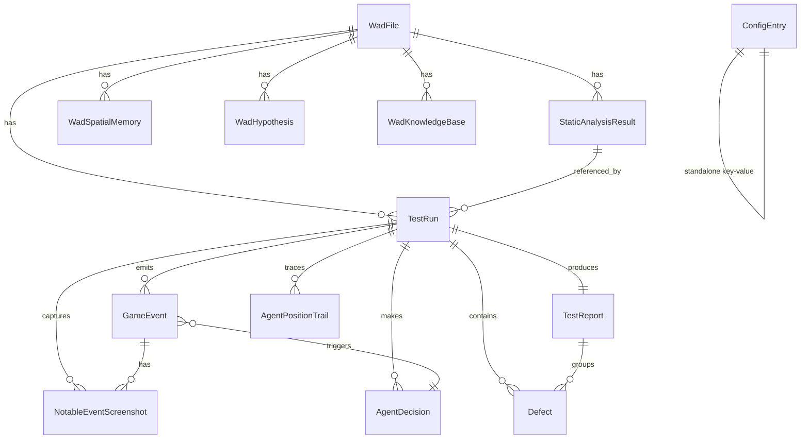

# Database Schema — Agentic PWAD QA for Doom

All 13 tables live under the `public` schema in PostgreSQL. The ORM uses SQLAlchemy 2.0 async with `asyncpg`. Every UUID primary key defaults to `gen_random_uuid()`.

## Entity-Relationship Diagram



---

## Table Reference

### 1. `wad_files`

The root entity — an uploaded PWAD file.

| Column               | Type              | Constraints                       | Notes                                        |
|----------------------|-------------------|-----------------------------------|----------------------------------------------|
| `id`                 | `UUID`            | PK, `gen_random_uuid()`           |                                              |
| `original_filename`  | `VARCHAR(255)`    | NOT NULL                          | Upload filename                              |
| `stored_path`        | `TEXT`            | NOT NULL, UNIQUE                  | Filesystem path to stored file               |
| `file_size_bytes`    | `BIGINT`          | NOT NULL                          |                                              |
| `sha256_hash`        | `VARCHAR(64)`     | NOT NULL, UNIQUE                  | Deduplication key                            |
| `uploaded_at`        | `TIMESTAMPTZ`     | NOT NULL, `now()`                 |                                              |
| `validation_status`  | `VARCHAR(32)`     | NOT NULL, default `'pending'`     | One of: `pending`, `valid`, `invalid`        |
| `validation_error`   | `TEXT`            | nullable                          |                                              |
| `detected_maps`      | `TEXT[]` (ARRAY)  | nullable                          | Map names extracted from WAD lumps           |
| `iwad_required`      | `VARCHAR(16)`     | NOT NULL, default `'freedoom2'`   | IWAD asset pack required to load this PWAD   |

**Relationships:**
- One-to-many → `static_analysis_results` (cascade delete)
- One-to-many → `test_runs`
- One-to-many → `wad_spatial_memory`, `wad_hypotheses`, `wad_knowledge_base`

---

### 2. `static_analysis_results`

Per-map static analysis extracted via Omgifol + Gemini enrichment.

| Column                  | Type             | Constraints                                      | Notes                                |
|-------------------------|------------------|--------------------------------------------------|--------------------------------------|
| `id`                    | `UUID`           | PK, `gen_random_uuid()`                          |                                      |
| `wad_file_id`           | `UUID`           | FK → `wad_files.id`, NOT NULL, ON DELETE CASCADE |                                      |
| `map_name`              | `VARCHAR(16)`    | NOT NULL                                         | e.g. `MAP01`                         |
| `thing_count_total`     | `INTEGER`        | NOT NULL, default 0                              |                                      |
| `thing_count_enemies`   | `INTEGER`        | NOT NULL, default 0                              |                                      |
| `thing_count_items`     | `INTEGER`        | NOT NULL, default 0                              |                                      |
| `thing_count_keys`      | `INTEGER`        | NOT NULL, default 0                              |                                      |
| `thing_count_weapons`   | `INTEGER`        | NOT NULL, default 0                              |                                      |
| `linedef_count`         | `INTEGER`        | NOT NULL, default 0                              |                                      |
| `sector_count`          | `INTEGER`        | NOT NULL, default 0                              |                                      |
| `secret_sector_count`   | `INTEGER`        | NOT NULL, default 0                              |                                      |
| `vertex_count`          | `INTEGER`        | NOT NULL, default 0                              |                                      |
| `map_width_units`       | `INTEGER`        | nullable                                         | Map bounding box                     |
| `map_height_units`      | `INTEGER`        | nullable                                         |                                      |
| `total_monster_hp`      | `INTEGER`        | nullable                                         | Sum of all monster hit points        |
| `total_health_pickup_pts` | `INTEGER`     | nullable                                         |                                      |
| `total_armor_pickup_pts`  | `INTEGER`     | nullable                                         |                                      |
| `hitscanner_percent`    | `NUMERIC(5,2)`   | nullable                                         |                                      |
| `health_ratio`          | `NUMERIC(8,4)`   | nullable                                         | Health supplied / needed ratio       |
| `ammo_ratio`            | `NUMERIC(8,4)`   | nullable                                         | Ammo supplied / needed ratio         |
| `estimated_difficulty`  | `VARCHAR(16)`    | nullable                                         | Gemini-estimated difficulty label    |
| `enemy_breakdown`       | `JSONB`          | NOT NULL, default `{}`                           | Enemy type → count                   |
| `item_breakdown`        | `JSONB`          | NOT NULL, default `{}`                           | Item type → count                    |
| `map_title`             | `TEXT`           | nullable                                         | From UMAPINFO / text lumps           |
| `map_display_name`      | `TEXT`           | nullable                                         |                                      |
| `map_title_source`      | `VARCHAR(32)`    | nullable                                         | `umapinfo`, `text`, `gemini`         |
| `spawn_summary_by_skill`| `JSONB`          | NOT NULL, default `{}`                           | Per-skill-level spawn breakdown      |
| `map_overview_png_path` | `TEXT`           | nullable                                         | Path to rendered overview PNG        |
| `analyzed_at`           | `TIMESTAMPTZ`    | NOT NULL, `now()`                                |                                      |

**Unique constraint:** `(wad_file_id, map_name)` — one analysis per map per WAD.

---

### 3. `test_runs`

The central entity — a single LLM-driven playthrough of one map.

| Column                 | Type             | Constraints                                    | Notes                                      |
|------------------------|------------------|------------------------------------------------|--------------------------------------------|
| `id`                   | `UUID`           | PK, `gen_random_uuid()`                        |                                            |
| `wad_file_id`          | `UUID`           | FK → `wad_files.id`, NOT NULL, CASCADE        |                                            |
| `static_analysis_id`   | `UUID`           | FK → `static_analysis_results.id`, SET NULL   |                                            |
| `map_name`             | `VARCHAR(16)`    | NOT NULL                                       |                                            |
| `difficulty_level`     | `SMALLINT`       | NOT NULL, default 3, CHECK 1–5                | Doom skill level                           |
| `iwad_used`            | `VARCHAR(64)`    | NOT NULL, default `'freedoom2'`               |                                            |
| `llm_model`            | `VARCHAR(128)`   | NOT NULL, default `'gemini-2.5-flash'`        |                                            |
| `behavior_profile`     | `VARCHAR(32)`    | default `'thorough'`                          | Agent personality                          |
| `max_ticks`            | `INTEGER`        | NOT NULL, default 3000                         | Max game ticks before force-stop           |
| `status`               | `VARCHAR(16)`    | NOT NULL, default `'pending'`                  | `pending│running│completed│failed│cancelled` |
| `started_at`           | `TIMESTAMPTZ`    | nullable                                       |                                            |
| `completed_at`         | `TIMESTAMPTZ`    | nullable                                       |                                            |
| `duration_seconds`     | `INTEGER`        | nullable                                       |                                            |
| `outcome`              | `VARCHAR(32)`    | nullable                                       | `completed│pwad_crash│agent_failure│timeout│cancelled` |
| `error_message`        | `TEXT`           | nullable                                       |                                            |
| `failure_category`     | `VARCHAR(32)`    | nullable                                       | High-level failure bucket                  |
| `failure_stage`        | `VARCHAR(64)`    | nullable                                       | Where in the run loop it failed            |
| `failure_summary`      | `TEXT`           | nullable                                       | Gemini-generated summary                   |
| `failure_diagnostics`  | `JSONB`          | nullable                                       | Structured diagnostics                     |
| `final_hp`             | `SMALLINT`       | nullable                                       |                                            |
| `final_armor`          | `SMALLINT`       | nullable                                       |                                            |
| `total_kills`          | `SMALLINT`       | nullable                                       |                                            |
| `total_deaths`         | `SMALLINT`       | nullable                                       |                                            |
| `secrets_found`        | `SMALLINT`       | nullable                                       |                                            |
| `total_items_collected`| `SMALLINT`       | nullable                                       |                                            |
| `total_actions_taken`  | `INTEGER`        | nullable                                       |                                            |
| `total_llm_calls`      | `INTEGER`        | nullable                                       |                                            |
| `recording_mp4_path`   | `TEXT`           | nullable                                       | Path to gameplay recording MP4             |
| `recording_metadata`   | `JSONB`          | nullable                                       | FPS, resolution, codec                     |
| `progress_metrics`     | `JSONB`          | nullable                                       | Area coverage, cell visit stats            |
| `agent_quality_flags`  | `JSONB`          | nullable                                       | Stuck detection, repetitive action counts  |
| `report_pdf_path`      | `TEXT`           | nullable                                       |                                            |
| `created_at`           | `TIMESTAMPTZ`    | NOT NULL, `now()`                              |                                            |

**Indexes:** `wad_file_id`, `status`, `created_at DESC`, composite `(wad_file_id, map_name, created_at DESC)`.

**Check:** `difficulty_level BETWEEN 1 AND 5`.

---

### 4. `game_events`

Tick-level game state snapshots. One row per tick per run.

| Column               | Type             | Constraints                                      | Notes                                |
|----------------------|------------------|--------------------------------------------------|--------------------------------------|
| `id`                 | `BIGSERIAL`      | PK                                               |                                      |
| `run_id`             | `UUID`           | FK → `test_runs.id`, NOT NULL, CASCADE           |                                      |
| `tick_number`        | `INTEGER`        | NOT NULL                                         |                                      |
| `recorded_at`        | `TIMESTAMPTZ`    | NOT NULL, `now()`                                |                                      |
| `player_x`           | `REAL`           | NOT NULL                                         |                                      |
| `player_y`           | `REAL`           | NOT NULL                                         |                                      |
| `player_angle`       | `SMALLINT`       | NOT NULL                                         | Degrees (0–359)                      |
| `health`             | `SMALLINT`       | NOT NULL                                         |                                      |
| `armor`              | `SMALLINT`       | NOT NULL                                         |                                      |
| `ammo_bullets`       | `SMALLINT`       | NOT NULL                                         |                                      |
| `ammo_shells`        | `SMALLINT`       | NOT NULL                                         |                                      |
| `ammo_rockets`       | `SMALLINT`       | NOT NULL                                         |                                      |
| `ammo_cells`         | `SMALLINT`       | NOT NULL                                         |                                      |
| `kill_count`         | `SMALLINT`       | NOT NULL                                         |                                      |
| `item_count`         | `SMALLINT`       | NOT NULL                                         |                                      |
| `secret_count`       | `SMALLINT`       | NOT NULL                                         |                                      |
| `weapon_selected`    | `SMALLINT`       | NOT NULL                                         | Weapon slot number                   |
| `agent_decision_id`  | `UUID`           | FK → `agent_decisions.id`, SET NULL              | Links event to the decision that caused it |
| `action_taken`       | `JSONB`          | nullable                                         | {button: value} dict                 |
| `llm_reasoning`      | `TEXT`           | nullable                                         | Raw LLM reasoning text               |
| `llm_input_summary`  | `TEXT`           | nullable                                         | Truncated prompt context              |
| `event_type`         | `VARCHAR(32)`    | NOT NULL, default `'normal'`                     | `normal`, `kill`, `damage_taken`, `item_pickup`, `death`, `secret_found`, `map_exit`, `stuck` |
| `killed_enemy_type`  | `VARCHAR(64)`    | nullable                                         |                                      |
| `damage_received`    | `SMALLINT`       | nullable                                         |                                      |

**Unique constraint:** `(run_id, tick_number)`.
**Partial index:** `(run_id, event_type)` WHERE `event_type != 'normal'` — fast notable-event lookups.

---

### 5. `agent_decisions`

Every LLM invocation and its associated MCP tool call.

| Column                | Type             | Constraints                                    | Notes                                  |
|-----------------------|------------------|------------------------------------------------|----------------------------------------|
| `id`                  | `UUID`           | PK, `gen_random_uuid()`                        |                                        |
| `run_id`              | `UUID`           | FK → `test_runs.id`, NOT NULL, CASCADE         |                                        |
| `sequence_number`     | `INTEGER`        | NOT NULL                                       | Order within the run                   |
| `tick_before`         | `INTEGER`        | nullable                                       | Tick when decision started             |
| `tick_after`          | `INTEGER`        | nullable                                       | Tick when action was applied           |
| `game_event_id`       | `BIGINT`         | FK → `game_events.id`, SET NULL                | The resulting event                    |
| `status`              | `VARCHAR(16)`    | NOT NULL, default `'started'`                  | `started`, `completed`, `failed`       |
| `error_message`       | `TEXT`           | nullable                                       |                                        |
| `llm_input_summary`   | `JSONB`          | nullable                                       | Environment observation + prompt       |
| `llm_decision`        | `JSONB`          | nullable                                       | Parsed action from LLM response        |
| `reasoning_summary`   | `TEXT`           | nullable                                       | Truncated reasoning                    |
| `mcp_tool`            | `VARCHAR(64)`    | nullable                                       | MCP tool name invoked                  |
| `mcp_input`           | `JSONB`          | nullable                                       | Tool call parameters                   |
| `mcp_output`          | `JSONB`          | nullable                                       | Tool result                            |
| `mcp_stop_reason`     | `VARCHAR(64)`    | nullable                                       | Why MCP stopped                        |
| `llm_duration_ms`     | `REAL`           | nullable                                       |                                        |
| `mcp_duration_ms`     | `REAL`           | nullable                                       |                                        |
| `llm_input_tokens`    | `INTEGER`        | nullable                                       |                                        |
| `llm_output_tokens`   | `INTEGER`        | nullable                                       |                                        |
| `llm_cost_estimate_usd`| `REAL`          | nullable                                       | Based on per-token pricing             |
| `created_at`          | `TIMESTAMPTZ`    | NOT NULL, `now()`                              |                                        |

**Unique constraint:** `(run_id, sequence_number)`.
**Indexes:** `run_id`, `(run_id, sequence_number)`.

---

### 6. `defects`

QA defects discovered during or synthesized after a run.

| Column               | Type             | Constraints                                      | Notes                                |
|----------------------|------------------|--------------------------------------------------|--------------------------------------|
| `id`                 | `UUID`           | PK, `gen_random_uuid()`                          |                                      |
| `run_id`             | `UUID`           | FK → `test_runs.id`, NOT NULL, CASCADE           |                                      |
| `report_id`          | `UUID`           | FK → `test_reports.id`, SET NULL                 | Assigned when report is generated    |
| `severity`           | `SMALLINT`       | NOT NULL, CHECK 1–4                              | 1=critical, 4=cosmetic               |
| `priority`           | `SMALLINT`       | NOT NULL, CHECK 1–3                              | 1=high, 3=low                        |
| `resolution_status`  | `VARCHAR(16)`    | NOT NULL, default `'open'`                       | `open`, `acknowledged`, `resolved`, `wont_fix` |
| `defect_type`        | `VARCHAR(64)`    | NOT NULL                                         | `visual_glitch`, `softlock`, `crash`, `misalignment`, `gameplay` |
| `fingerprint`        | `VARCHAR(128)`   | nullable                                         | Dedup hash across runs               |
| `title`              | `VARCHAR(255)`   | NOT NULL                                         |                                      |
| `description`        | `TEXT`           | NOT NULL                                         |                                      |
| `reproduction_steps` | `TEXT`           | nullable                                         | Tick-by-tick steps                   |
| `detected_at_tick`   | `INTEGER`        | nullable                                         |                                      |
| `position_x`         | `REAL`           | nullable                                         |                                      |
| `position_y`         | `REAL`           | nullable                                         |                                      |
| `screenshot_id`      | `UUID`           | FK → `notable_event_screenshots.id`, SET NULL    |                                      |
| `recommendation`     | `TEXT`           | nullable                                         | Suggested fix                        |
| `first_seen_tick`    | `INTEGER`        | nullable                                         | For dedup across runs                |
| `last_seen_tick`     | `INTEGER`        | nullable                                         |                                      |
| `occurrence_count`   | `INTEGER`        | NOT NULL, default 1                              | How many times this was observed     |
| `created_at`         | `TIMESTAMPTZ`    | NOT NULL, `now()`                                |                                      |

**Unique constraints:** `(run_id, defect_type, detected_at_tick)`, `(run_id, fingerprint)`.

---

### 7. `test_reports`

Generated QA reports in structured JSON (later rendered to PDF).

| Column                        | Type             | Constraints                          | Notes                                  |
|-------------------------------|------------------|--------------------------------------|----------------------------------------|
| `id`                          | `UUID`           | PK, `gen_random_uuid()`              |                                        |
| `run_id`                      | `UUID`           | FK → `test_runs.id`, NOT NULL, UNIQUE, CASCADE | One report per run          |
| `report_purpose`              | `TEXT`           | nullable                             |                                        |
| `intended_audience`           | `TEXT`           | NOT NULL                             |                                        |
| `problem_and_escalation`      | `TEXT`           | nullable                             |                                        |
| `test_items_summary`          | `TEXT`           | nullable                             |                                        |
| `test_environment_summary`    | `TEXT`           | nullable                             |                                        |
| `hardware_spec`               | `JSONB`          | nullable                             |                                        |
| `software_spec`               | `JSONB`          | nullable                             |                                        |
| `variances_from_plan`         | `TEXT`           | nullable                             |                                        |
| `test_procedure_variances`    | `TEXT`           | nullable                             |                                        |
| `test_case_variances`         | `TEXT`           | nullable                             |                                        |
| `test_coverage_evaluation`    | `TEXT`           | nullable                             |                                        |
| `objectives_planned`          | `JSONB`          | nullable                             |                                        |
| `objectives_covered`          | `JSONB`          | nullable                             |                                        |
| `objectives_omitted`          | `JSONB`          | nullable                             |                                        |
| `uncovered_attributes`        | `TEXT`           | nullable                             |                                        |
| `test_process_changes`        | `TEXT`           | nullable                             |                                        |
| `defect_summary_narrative`    | `TEXT`           | nullable                             |                                        |
| `defect_patterns`             | `TEXT`           | nullable                             |                                        |
| `test_item_limitations`       | `TEXT`           | nullable                             |                                        |
| `dropped_features`            | `TEXT`           | nullable                             |                                        |
| `pass_fail_summary`           | `JSONB`          | nullable                             |                                        |
| `risk_areas`                  | `JSONB`          | nullable                             |                                        |
| `good_quality_areas`          | `JSONB`          | nullable                             |                                        |
| `major_activities_summary`    | `TEXT`           | nullable                             |                                        |
| `activity_variances`          | `TEXT`           | nullable                             |                                        |
| `elapsed_time_seconds`        | `INTEGER`        | nullable                             |                                        |
| `total_actions_taken`         | `INTEGER`        | nullable                             |                                        |
| `pdf_path`                    | `TEXT`           | nullable                             |                                        |
| `generated_at`                | `TIMESTAMPTZ`    | NOT NULL, `now()`                    |                                        |
| `generation_status`           | `VARCHAR(16)`    | NOT NULL, default `'generating'`     | `generating│complete│failed`          |
| `generation_error`            | `TEXT`           | nullable                             |                                        |

**Relationships:** Belongs to one `TestRun`. Has many `Defect` entries.
**Unique** `run_id`: strictly one-to-one.

---

### 8. `agent_position_trail`

Lightweight position-only records for path visualisation.

| Column        | Type        | Constraints                          | Notes            |
|---------------|-------------|--------------------------------------|------------------|
| `id`          | `BIGSERIAL` | PK                                   |                  |
| `run_id`      | `UUID`      | FK → `test_runs.id`, NOT NULL, CASCADE |                |
| `tick_number` | `INTEGER`   | NOT NULL                             |                  |
| `x`           | `REAL`      | NOT NULL                             |                  |
| `y`           | `REAL`      | NOT NULL                             |                  |
| `health`      | `SMALLINT`  | NOT NULL                             |                  |

**Index:** `run_id`.

---

### 9. `notable_event_screenshots`

Screenshots captured at notable events (kills, deaths, damage, secrets).

| Column            | Type        | Constraints                                    | Notes          |
|-------------------|-------------|------------------------------------------------|----------------|
| `id`              | `UUID`      | PK, `gen_random_uuid()`                        |                |
| `run_id`          | `UUID`      | FK → `test_runs.id`, NOT NULL, CASCADE         |                |
| `game_event_id`   | `BIGINT`    | FK → `game_events.id`, NOT NULL, CASCADE       |                |
| `screenshot_path` | `TEXT`      | NOT NULL                                       | Filesystem path |
| `captured_at`     | `TIMESTAMPTZ`| NOT NULL, `now()`                              |                |

**Index:** `run_id`.

---

### 10. `config_entries`

Runtime-overridable settings persisted across restarts. A simple key-value store.

| Column       | Type          | Constraints              | Notes                          |
|--------------|---------------|--------------------------|--------------------------------|
| `key`        | `VARCHAR(128)`| PK                       |                                |
| `value`      | `JSONB`       | NOT NULL                 | Any JSON-serializable value    |
| `updated_at` | `TIMESTAMPTZ` | `now()`                  |                                |

---

### 11. `wad_spatial_memory`

Spatial cell-level event counts aggregated across runs — enables the agent to remember where things happened in previous playthroughs.

| Column             | Type         | Constraints                                     | Notes                                  |
|--------------------|--------------|-------------------------------------------------|----------------------------------------|
| `id`               | `UUID`       | PK, `gen_random_uuid()`                         |                                        |
| `wad_file_id`      | `UUID`       | FK → `wad_files.id`, NOT NULL, CASCADE          |                                        |
| `map_name`         | `VARCHAR(16)`| NOT NULL                                        |                                        |
| `cell_x`           | `SMALLINT`   | NOT NULL                                        | Grid column index (map / stride)       |
| `cell_y`           | `SMALLINT`   | NOT NULL                                        | Grid row index                         |
| `event_type`       | `VARCHAR(32)`| NOT NULL                                        | Type of event observed in this cell    |
| `occurrence_count` | `BIGINT`     | NOT NULL, default 1                             | Cumulative across runs                 |
| `last_seen_run_id` | `UUID`       | FK → `test_runs.id`, SET NULL                   | Most recent run that observed this     |
| `created_at`       | `TIMESTAMPTZ`| NOT NULL, `now()`                               |                                        |
| `updated_at`       | `TIMESTAMPTZ`| NOT NULL, `now()`, auto-updates                 |                                        |

**Unique:** `(wad_file_id, map_name, cell_x, cell_y, event_type)`.
**Purpose:** Enables the agent to prioritise unexplored cells and avoid revisiting known-safe areas.

---

### 12. `wad_hypotheses`

Hypotheses about a map's structure, hazards, or secrets — generated by the LLM and validated or refuted across runs.

| Column             | Type          | Constraints                                    | Notes                                  |
|--------------------|---------------|------------------------------------------------|----------------------------------------|
| `id`               | `UUID`        | PK, `gen_random_uuid()`                        |                                        |
| `wad_file_id`      | `UUID`        | FK → `wad_files.id`, NOT NULL, CASCADE         |                                        |
| `map_name`         | `VARCHAR(16)` | NOT NULL                                       |                                        |
| `tag`              | `VARCHAR(32)` | NOT NULL                                       | One of: `BLOCKED_PATH`, `KEY_LOCATION`, `RESOURCE_CACHE`, `VISUAL_GLITCH`, `ENCOUNTER_HOTSPOT`, `NAVIGATION_GAP` |
| `content`          | `TEXT`        | NOT NULL                                       | Natural language hypothesis            |
| `confidence`       | `FLOAT`       | NOT NULL, default 0.5                          | 0.0–1.0                                |
| `confirmed_at`     | `TIMESTAMPTZ` | nullable                                       | When a subsequent run validated it     |
| `refuted_at`       | `TIMESTAMPTZ` | nullable                                       | When a subsequent run disproved it     |
| `last_seen_run_id` | `UUID`        | FK → `test_runs.id`, SET NULL                  |                                        |
| `created_at`       | `TIMESTAMPTZ` | NOT NULL, `now()`                              |                                        |
| `updated_at`       | `TIMESTAMPTZ` | NOT NULL, `now()`, auto-updates                |                                        |

**Purpose:** Enables the LLM to carry forward insights ("the red key is behind the yellow door in the north-east wing") from one run to the next, improving efficiency and coverage.

---

### 13. `wad_knowledge_base`

A single evolving document per (WAD, map) pair that accumulates structured knowledge extracted by the LLM across runs.

| Column         | Type          | Constraints                                    | Notes                              |
|----------------|---------------|------------------------------------------------|------------------------------------|
| `id`           | `UUID`        | PK, `gen_random_uuid()`                        |                                    |
| `wad_file_id`  | `UUID`        | FK → `wad_files.id`, NOT NULL, CASCADE         |                                    |
| `map_name`     | `VARCHAR(16)` | NOT NULL                                       |                                    |
| `document_text`| `TEXT`        | NOT NULL, default `''`                         | Structured knowledge document      |
| `version`      | `INTEGER`     | NOT NULL, default 0                            | Monotonically increasing version   |
| `created_at`   | `TIMESTAMPTZ` | NOT NULL, `now()`                              |                                    |
| `updated_at`   | `TIMESTAMPTZ` | NOT NULL, `now()`, auto-updates                |                                    |

**Unique:** `(wad_file_id, map_name)`.
**Purpose:** A persistent "runbook" for the map — the LLM reads this before starting a new run and appends findings afterward. Enables cumulative learning.

---

## Cross-run Memory Architecture

The three memory models form a tiered system that enables the agent to learn across playthroughs without retraining:

```
WadSpatialMemory (low-level)
   Grid-based cell event frequency
   → "This cell has seen 3 kills and 1 secret"
   → Avoid/resample strategy

WadHypothesis (mid-level)
   Tagged natural-language claims
   → "BLOCKED_PATH at (120, 450) is a red door"
   → Confirmed/refuted over runs

WadKnowledgeBase (high-level)
   Evolving structured document
   → "MAP01: key layout, monster roster, secrets, navigation notes"
   → Read at session start, appended at session end
```

All three are scoped to a `(wad_file_id, map_name)` pair and cleared when the WAD is deleted (CASCADE). The `last_seen_run_id` FK on spatial memory and hypotheses allows the system to track recency.
