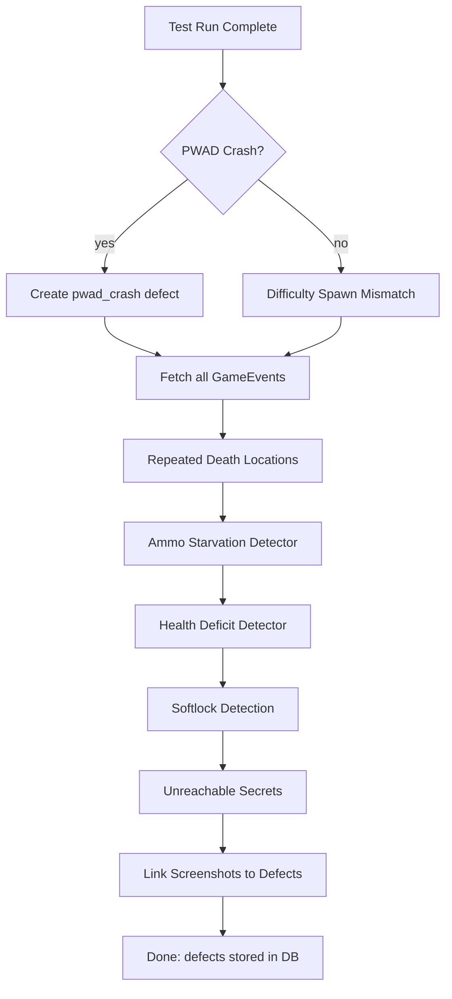

# Defect Detection System

The defect detection pipeline runs **post-run** as part of `DefectService.detect_for_run` (`defect_service.py:20-33`). It implements 7 detector algorithms and also captures **agent-observed defects** that the LLM reports during gameplay.

---

## Detection Pipeline



---

## Detector 1: PWAD Crash

**File:** `defect_service.py:35-55`  
**Defect type:** `pwad_crash`  
**Severity:** 1 (highest) | **Priority:** 1

Triggers when `run.failure_category == "pwad_crash"` or `run.outcome == "pwad_crash"`. This means `agent_run_task` caught an exception during `start_game` or gameplay that was classified as a PWAD crash (as opposed to infrastructure failure).

- `detected_at_tick`: 0
- Uses `run.failure_summary` for the description
- Recommends reviewing map markers, resources, and runtime diagnostics

---

## Detector 2: Difficulty Spawn Mismatch

**File:** `defect_service.py:57-92`  
**Defect type:** `difficulty_spawn_mismatch`  
**Severity:** 2 (enemies hidden) or 3 (items only) | **Priority:** 2

Compares raw static analysis thing counts against what actually spawns at the run's difficulty level. Doom's skill flags (`easy`/`medium`/`hard`) and `multiplayer` flag can hide things.

- If `spawned_enemies < raw_enemies` or `spawned_items < raw_items`, a defect is created
- Skips if raw counts are zero or nothing is hidden
- `detected_at_tick`: 0
- Recommends reviewing THINGS difficulty flags or running QA at a different skill

---

## Detector 3: Repeated Death Locations

**File:** `defect_service.py:94-114`  
**Defect type:** `repeated_death_location`  
**Severity:** 2 | **Priority:** 1

Groups death events into 50-unit grid buckets. If any bucket contains more than one death, creates a defect.

- Suggests spawn camping or unfair death traps
- `detected_at_tick` = tick of the first death in the group
- `position_x/y` = position of the first death

---

## Detector 4: Ammo Starvation

**File:** `defect_service.py:116-140`  
**Defect type:** `ammo_starvation`  
**Severity:** 2 | **Priority:** 2

Uses the `_streak_episodes` helper to find contiguous runs of events where total ammo (bullets + shells + rockets + cells) == 0 for **61+ consecutive ticks**.

- Creates one defect per starvation episode
- `fingerprint`: `ammo_starvation:{first_tick}` — enables cross-run dedup
- `first_seen_tick` / `last_seen_tick`: episode boundaries
- `occurrence_count`: length of the streak

---

## Detector 5: Health Deficit

**File:** `defect_service.py:142-162`  
**Defect type:** `health_deficit`  
**Severity:** 3 | **Priority:** 3

Uses `_streak_episodes` to find contiguous runs where `health < 10` for **31+ consecutive ticks**.

- Same fingerprint and occurrence tracking as ammo starvation
- `fingerprint`: `health_deficit:{first_tick}`

---

## Detector 6: Softlock Detection

**File:** `defect_service.py:164-208`  
**Defect type:** `softlock_navigation`  
**Severity:** 1 | **Priority:** 1

Two detection patterns:

1. **Explicit stuck outcome:** If `run.outcome in {"stuck", "timeout"}` and there are ≥3 stuck-type events → defect with title "Run stalled after repeated stuck decisions". Note: "timeout" outcomes are reclassified as "stuck".

2. **Silent timeout softlock:** If `run.outcome == "timeout"` and the last 30 events show total movement < 20 units → defect with title "Potential navigation softlock". This catches agents that are running in circles without enough positional change to trigger the stuck detector.

---

## Detector 7: Unreachable Secrets

**File:** `defect_service.py:210-236`  
**Defect type:** `unreachable_secret`  
**Severity:** 3 | **Priority:** 3

Triggers when ALL of these conditions are met:
- Static analysis found `secret_sector_count > 0`
- The agent found zero secrets (`max(event.secret_count) == 0`)
- Coverage reached ≥60% (`coverage_percent >= 60.0`)

The 60% threshold ensures the agent explored enough of the map to reasonably be expected to find a secret. Below that, the defect is considered inconclusive.

---

## How Defects Are Created

### Pipeline Flow

```mermaid
sequenceDiagram
    participant Loop as Agent Loop
    participant Collector as CollectorService
    participant DefectSvc as DefectService
    participant Repo as DefectRepository
    participant Screen as NotableEventScreenshot

    Loop->>Loop: Run completes
    Loop->>DefectSvc: detect_for_run(run)
    
    DefectSvc->>DefectSvc: _pwad_crash(run)
    DefectSvc->>DefectSvc: _difficulty_spawn_mismatch(run, analysis)
    DefectSvc->>DefectSvc: Fetch all GameEvents
    
    DefectSvc->>DefectSvc: _repeated_deaths(run_id, events)
    DefectSvc->>DefectSvc: _ammo_starvation(run_id, events)
    DefectSvc->>DefectSvc: _health_deficit(run_id, events)
    DefectSvc->>DefectSvc: _softlock(run, events)
    DefectSvc->>DefectSvc: _unreachable_secrets(run, events, analysis)
    
    DefectSvc->>DefectSvc: _link_screenshots_to_defects(run_id)
    DefectSvc->>Screen: Find screenshots by game_event_id
    Screen-->>DefectSvc: screenshot IDs
    DefectSvc->>DefectSvc: Match defects to screenshots by detected_at_tick
    DefectSvc->>Repo: Persist all defects with linked screenshots
```

### Agent-Observed Defects (Live Detection)

During the run loop, the LLM can report issues directly via the `observed_issue` field in its decision JSON. The `CollectorService.collect` method (`collector_service.py:91-123`) processes these:

1. `normalize_observed_issue(issue)` parses the format:
   - Dict: `{"category": "geometry", "description": "..."}` → `agent_observed_geometry`
   - String: `[resource_balance] description` → `agent_observed_resource_balance`
   - Known categories: `geometry`, `resource_balance`, `progression`, `encounter_design`, `pwad_crash`
   - Unknown categories fall back to `agent_observed`

2. Duplicate suppression: checks existing defects for same type + tick proximity (±500 ticks) + position proximity (<100 units)

3. Creates a `Defect` with `severity=2`, `priority=2`, linked to the current game event's position and tick

---

## Fingerprinting System

Defect deduplication uses a `fingerprint` string field. The strategy differs by detector:

| Detector | Fingerprint Strategy |
|----------|---------------------|
| PWAD Crash | None (at most one per run) |
| Difficulty Spawn Mismatch | None (at most one per run) |
| Repeated Deaths | None (dedup by grid bucket) |
| Ammo Starvation | `ammo_starvation:{first_tick}` |
| Health Deficit | `health_deficit:{first_tick}` |
| Softlock | None (at most one per run) |
| Unreachable Secrets | None (at most one per run) |
| Agent-Observed | None (dedup by proximity) |

In `PatternService.get_patterns` and `RunCompareService.compare`, missing fingerprints use `defect_type:title` (and `detected_at_tick`) as fallback keys.

---

## Severity & Priority Classification

| Severity | Level | Detectors |
|----------|-------|-----------|
| 1 | Critical | PWAD Crash, Softlock |
| 2 | Major | Difficulty Spawn Mismatch (enemies), Repeated Deaths, Ammo Starvation, Agent-Observed |
| 3 | Minor | Difficulty Spawn Mismatch (items only), Health Deficit, Unreachable Secrets |

| Priority | Level | Detectors |
|----------|-------|-----------|
| 1 | High | PWAD Crash, Repeated Deaths, Softlock |
| 2 | Medium | Difficulty Spawn Mismatch, Ammo Starvation |
| 3 | Low | Health Deficit, Unreachable Secrets |

---

## Screenshot Linking

`_link_screenshots_to_defects` (`defect_service.py:238-262`):

1. Fetches all screenshots (`NotableEventScreenshot`) for the run, keyed by `game_event_id`
2. Fetches all events, builds `tick_number → event_id` mapping
3. For each defect that has `detected_at_tick` set and no `screenshot_id`:
   - Looks up the event at that tick
   - Links the screenshot if one exists for that event

Screenshots are captured during the run loop for notable events: `kill`, `death`, `damage_taken`, `stuck`. They are saved via `recorder.save_screenshot(frame, event_id)`.

---

## Pattern Service (Cross-Run Grouping)

**File:** `pattern_service.py`

`PatternService.get_patterns(wad_id)` groups defects across all runs of the same WAD:

1. **Fingerprint grouping**: Defects with the same fingerprint are grouped together. Groups with ≥2 occurrences become patterns.
2. **Spatial clustering**: Defects with position data are grouped into 128-unit grid cells, ordered by density.
3. **Difficulty coverage**: Aggregates run outcomes and defect counts by difficulty level.

Returns:
- `defect_patterns`: fingerprint groups with occurrence count, affected runs, average severity, grid clusters
- `defect_clusters`: top 10 spatial clusters by cell
- `difficulty_coverage`: per-difficulty run counts, completion/failure stats, defect totals

The pattern service feeds into cross-run memory (`RunMemoryService.build_cross_run_memory`) and the report pass/fail summary.
