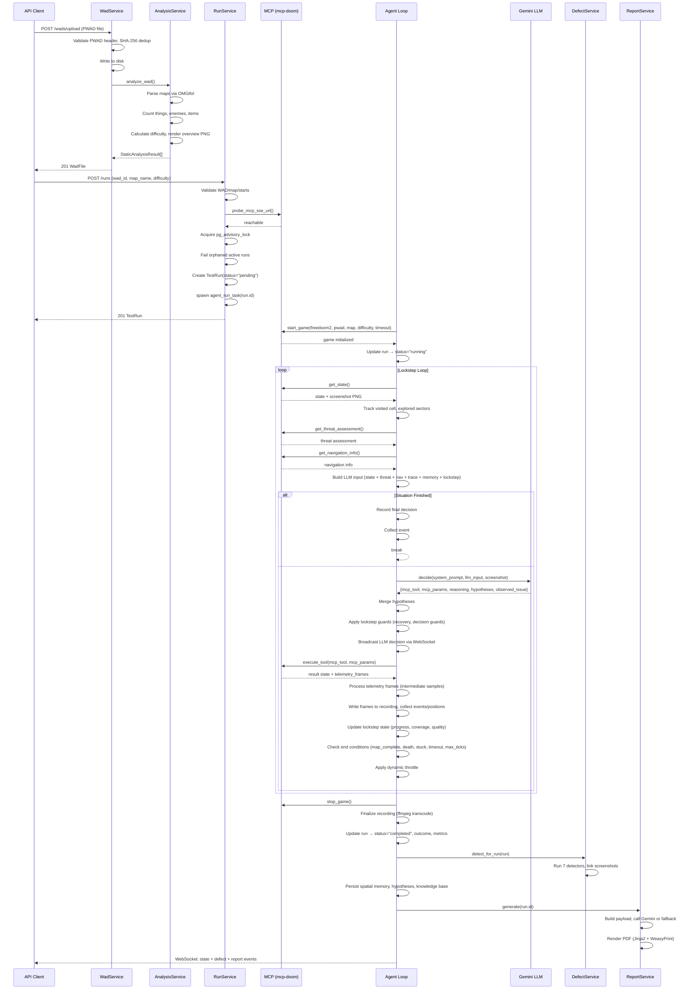

# Run Lifecycle & Agent Loop

## Overview

A test run progresses through six discrete stages: upload → static analysis → run creation → gameplay loop → defect detection → report generation. The run is managed by an asyncio task spawned by `RunService.create_run` and tracked in `RUN_TASKS`.

---

## Complete Lifecycle

---

## Lockstep AI Loop (Detailed)

The loop in `agent_run_task` (`run_loop.py:76-608`) executes the following 14 steps per decision cycle:

### Step 1: Get Game State
Call `mcp.get_state()` which invokes MCP tool `get_state`. Returns normalized state dict + raw screenshot PNG bytes. Extract tick via `_unique_lockstep_tick`.

### Step 2: Fetch Threat Assessment & Navigation Info
Call MCP tools `get_threat_assessment()` and `get_navigation_info()` with error tolerance via `_safe_context_tool`. These provide monster threat data and navigation cues (doors, unexplored directions, cells explored).

### Step 3: Track Visited Cells & Explored Sectors
- `_track_visited_cell(state)` — Hashes current (x, y) to a grid cell key (`round(x/CELL_SIZE)_round(y/CELL_SIZE)`), marks it visited
- `_track_explored_sectors(state, nav_info)` — Collects sector IDs from state and navigation info

Coverage metrics: `visited_cells_count`, `total_map_cells_estimate`, `coverage_percent`, `unvisited_quadrants`.

### Step 4: Build LLM Input
Assembles a dict with:
- `tick`, `ticks_remaining`
- Compact state via `_compact_state_for_llm` (truncated objects, no screenshot)
- `threat_assessment`, `navigation_info`
- `recent_trace` — Last 5 meaningful LLM reasoning entries
- `structured_memory` — Explored sectors, attempted interactions, hypotheses
- `cross_run_memory` — Prior run outcomes and defect patterns
- `lockstep_state` — Progress snapshot with quality warnings
- `exploration_coverage` — Cell counts, coverage %, quadrants, warnings

### Step 5: Check if Situation is Finished
`_situation_finished(state)` checks for `episode_finished`, `episode_timeout`, `level_completed`, `next_map`, or `dead`. If true, the loop records a final `get_state` decision and breaks.

### Step 6: Call Gemini LLM
Broadcast `llm_start` via WebSocket, create an `AgentDecision` row with `status="started"`, then call `gemini.decide()` with screenshot PNG. The LLM returns a JSON decision with `mcp_tool`, `mcp_params`, `reasoning_summary`, `hypotheses`, and `observed_issue`.

On failure: 3 retry attempts with rate-limit-aware backoff + jitter. All 3 exhausted → deterministic fallback.

Token usage and cost estimation are recorded on the decision row.

### Step 7: Apply Guards
Two guard passes execute:

1. **`_apply_lockstep_recovery`** — Stuck detection via progress signature. If progress hasn't changed for `STUCK_RUN_ABORT_THRESHOLD` (5) polls:
   - Fires a **QA probe burst** (4 `take_action` probes: turn → move → use → retreat)
   - After 4 recovery cycles, marks `should_stop_stuck = True`
   - Low-value explore override (`>=2` consecutive max_tics explores) triggers probe burst

2. **`_guard_lockstep_decision`** — Blocks:
   - Repeated action signatures (same tool + params ≥4 times)
   - Targeting already-completed or failed objects
   - Combat against out-of-ammo targets
   - Combat against non-visible monsters (switches to explore)

Blocked decisions increment `blocked_decision_count`; at threshold (6) the run is stopped as stuck.

### Step 8: Broadcast LLM Decision via WebSocket
Payload includes: `reasoning_summary`, `mcp_tool`, `mcp_params`, `llm_duration_ms`, `llm_input_tokens`, `llm_output_tokens`, `llm_cost_estimate_usd`, raw LLM output, and guard status (`kept`/`modified`).

### Step 9: Execute Chosen MCP Tool with Bounded Params
`_execute_tool` routes the decision to the correct MCP call:

| LLM Tool | MCP Tool | Bounding |
|----------|----------|----------|
| `explore` | `explore` | max_tics=[20, 80], stop_on_enemy/stop_on_item bool |
| `aim_and_shoot` | `aim_and_shoot` | max_tics=[10, 120], shots=[1, 8], object_id required |
| `strafe_and_shoot` | `strafe_and_shoot` | Same + direction in {left, right, auto} |
| `move_to` | `move_to` | max_tics=[20, 180], object_id required |
| `retreat` | `retreat` | tics=[8, 70], backpedal bool |
| `take_action` | `take_action` | actions validated per button allowlist, tics=[1, 8] |
| `get_state` | `get_state` | include_sectors, include_depth |

If a combat tool targets a non-visible monster, or an `object_id` tool is called without one, the tool falls back to `explore`.

The LLM-requested `telemetry_stride` is overridden with `_compute_dynamic_stride`: combat=1, stuck=5, default=3.

### Step 10: Process Telemetry Frames
Compound MCP tools (`explore`, `move_to`, etc.) return intermediate `telemetry_frames`. For each frame:
- `_pop_telemetry_frames` extracts them from the result
- `_record_telemetry_frames` processes each sample:
  - Records position-only `AgentPositionTrail` entries
  - Decodes PNG base64 → writes to OpenCV recording
  - Broadcasts live JPEG frames at `live_frame_fps`

### Step 11: Record Frames, Collect Events/Positions
- The result screenshot is written to the OpenCV recording
- `_update_lockstep_after_action` updates:
  - Action signature counts (LRU, last 50)
  - Attempted interactions log (last 30)
  - Consecutive low-value explore tracking
  - Completed/failed object IDs
  - Out-of-ammo target tracking
  - Wasted combat counter
  - Progress score
- `collector.collect()` creates a `GameEvent` with normalized variables, detected event type, and the action trace
- If event type is notable (kill, death, damage_taken, stuck), a screenshot is saved and linked to the event
- Telegram frame broadcasts at `live_frame_fps`

### Step 12: Update Lockstep State
`_finalize_lockstep_decision` updates:
- `new_cells_last_5_decisions` — Rolling sum of newly visited cells
- `_new_cells_current` is reset

`_lockstep_progress_metrics` is called to broadcast progress: `progress_score`, `meaningful_progress_events`, `completed_object_count`, `failed_object_count`, `coverage_percent`, `unvisited_quadrants`.

### Step 13: Check for Run-Ending Conditions
Checked in order after each decision:
1. `map_exit` event or `level_completed` / `next_map` → `outcome = "map_completed"`
2. `health <= 0` or `dead` → `outcome = "player_died"`
3. `_lockstep_should_stop_as_stuck` → `outcome = "stuck"` (or `"incomplete_coverage"`)
4. `episode_finished` or `episode_timeout` → `outcome = "timeout"`
5. `tick >= max_ticks` → `outcome = "timeout"`

### Step 14: Apply Dynamic Throttle
`_compute_dynamic_throttle` returns a sleep delay based on the state:
- **Combat** (visible monsters): 3s
- **Low health** (<25 HP) or **zero ammo**: 6s
- **Stuck** (≥2 no-progress polls): 10s
- **Default**: 12s

The delay is capped at `llm_throttle_cap_seconds` (configurable). During throttle, the game remains paused (the whole loop is lockstep — the game only advances during MCP tool execution).

---

## Post-Loop Finalization

After the loop exits:

1. **MCP cleanup**: `mcp_client.stop_game()` is called
2. **Recording**: `recorder.finalize()` transcodes raw mp4v → H.264 via ffmpeg, validates quality
3. **Run update**: `completed_at`, `outcome`, `total_actions_taken`, `total_llm_calls`, `recording_metadata`, `progress_metrics`, `agent_quality_flags` are persisted
4. **Defect detection**: `DefectService.detect_for_run(run)` runs all 7 detectors
5. **Memory persistence**: Spatial memory, hypotheses, and knowledge base are updated
6. **Report generation**: `ReportService.generate(run.id)` creates PDF via Gemini + Jinja2 + WeasyPrint
7. **WebSocket cleanup**: `websocket_service.cleanup_run(run.id)` closes all connections
8. **Task cleanup**: `RUN_TASKS.pop(run.id)` removes the task reference
