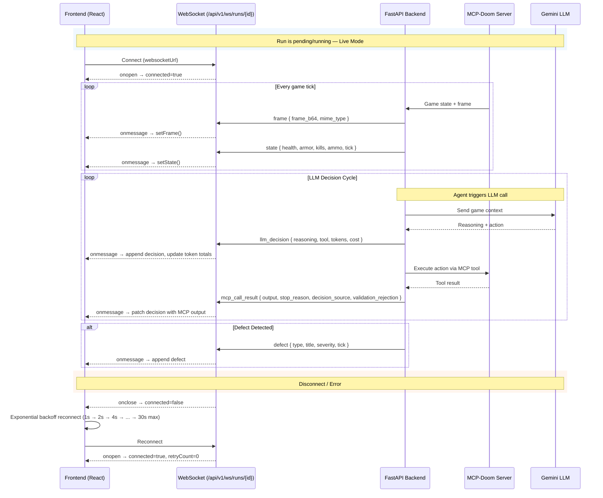
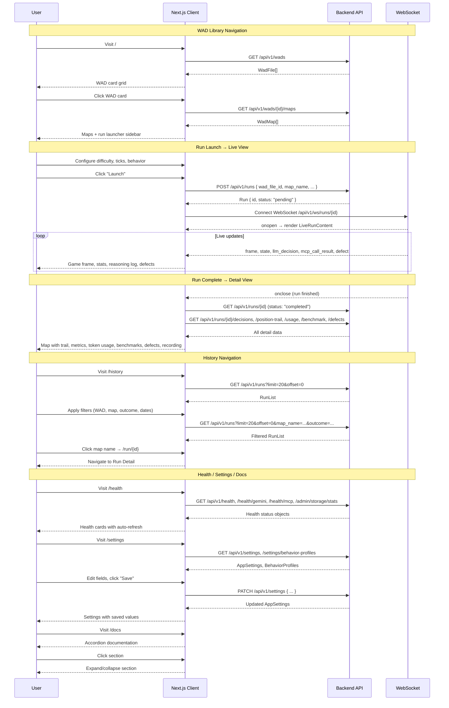

# Pages & Data Flow

All pages are `"use client"` components using `@tanstack/react-query` for data fetching and `next/navigation` for routing.

---

## 1. WAD Library (`/` — `app/page.tsx`)

Lists all uploaded WAD files as a responsive card grid (`md:grid-cols-2`, `xl:grid-cols-3`).

**Data Fetching:**
- `GET /api/v1/wads` → `WadFile[]` — query key `["wads"]`
- Each card fetches its thumbnail: `GET /api/v1/wads/{id}/maps` → `WadMap[]` — query key `["wad-thumb", wadId]`

**User Actions:**
- Click a WAD card → `router.push(/wad/${wad.id})`
- Upload a new WAD via `UploadZone` (drag-and-drop or file picker, `.wad` only) → `POST /api/v1/wads/upload` (FormData). On success: invalidates `["wads"]` query, navigates to `/wad/{newId}`.

**Components:** `Metric`, `SkeletonRows`, `InlineError`, `UploadZone` (inline)

---

## 2. WAD Detail + Run Launcher (`/wad/[id]` — `app/wad/[id]/page.tsx`)

Two-column layout: left panel shows maps, right panel (sticky sidebar) is the run launcher.

**Data Fetching:**
- `GET /api/v1/wads/{id}` → `WadFile` — query key `["wad", id]`
- `GET /api/v1/wads/{id}/maps` → `WadMap[]` — query key `["wad-maps", id]`
- `GET /api/v1/settings/behavior-profiles` → `Record<string, BehaviorProfile>` — query key `["behavior-profiles"]`

**Run Launcher Controls:**
| Control | State | Description |
|---------|-------|-------------|
| Map selector | `selectedMap` | Click a map card to select; cyan border highlights active |
| Difficulty | `difficulty` | 5-button row (1–5), default 3 |
| Max ticks | `maxTicks` | Range slider (500–35,000, step 500), default 3,000 |
| Behavior profile | `behaviorProfile` | Dropdown from profiles API, fallback hardcoded options |
| Launch button | `startRun` | Disabled until a map is selected; shows "Launching" while pending |

**Launch:**
- `POST /api/v1/runs` with body `{ wad_file_id, map_name, difficulty_level, max_ticks, behavior_profile }` → `Run`
- On success: invalidates `["runs"]`, navigates to `/run/{run.id}`

**Components:** `MapCanvas`, `SkillHeatmap`, `Metric`, `SkeletonRows`, `InlineError`

---

## 3. Run Detail (`/run/[id]` — `app/run/[id]/page.tsx`)

Two modes based on `run.status`:

### Live Mode (`running` or `pending`)

```
┌─────────────────────────────────────────────────────────┐
│  RunPage                                                 │
│  ┌─────────────── run.status ────────────────────────┐  │
│  │  running/pending → LiveRunContent                  │  │
│  │  completed/failed → RunDetailContent               │  │
│  └────────────────────────────────────────────────────┘  │
└─────────────────────────────────────────────────────────┘
```

**LiveRunContent** renders a full-height split layout:
- Left: game frame (base64 image from WebSocket) with connection status bar, token totals, defect badge, and cancel button
- Right: `ReasoningLog` (auto-scrolling live feed)
- Bottom: `StatBar` with live state

### Detail Mode (`completed`, `failed`, etc.)

**Data Fetching (9 parallel queries):**

| Query Key | Endpoint | Data | Polling |
|-----------|----------|------|---------|
| `["run", runId]` | `GET /runs/{id}` | `Run` | 5s |
| `["run-defects", runId]` | `GET /runs/{id}/defects` | `Defect[]` | — |
| `["run-decisions", runId]` | `GET /runs/{id}/decisions?page_size=500` | `Decision[]` | — |
| `["run-trail", runId]` | `GET /runs/{id}/position-trail` | `PositionSample[]` | — |
| `["run-events", runId]` | `GET /runs/{id}/events?type=kill,death,...` | `TraceEntry[]` | — |
| `["run-usage", runId]` | `GET /runs/{id}/usage` | `UsageStats` | — |
| `["run-benchmark", runId]` | `GET /runs/{id}/benchmark` | `BenchmarkStats` | — |
| `["run-report-status", runId]` | `GET /runs/{id}/report/status` | `ReportStatus` | 3s |
| `["run-maps", wadFileId]` | `GET /wads/{wadFileId}/maps` | `WadMap[]` | — (enabled once `run.data?.wad_file_id` is available) |

**Sections (top to bottom):**

1. **Header** — Map name, run ID, behavior profile, outcome badge, "Live" button to re-enter live mode
2. **Map + Metrics** — `MapCanvas` with trail + events, 6 key metrics (Duration, Actions, Final HP, Kills, Secrets, Defects)
3. **Token Usage** — LLM calls, prompt/completion/total tokens, cost, avg cost/decision, model
4. **Performance Benchmark** — LLM latency (avg, p50, p95, min, max, count), MCP latency, tools used breakdown
5. **Defects** — List with title, severity, description
6. **Decision Trace + Recording** — Two-column: `DecisionTimeline` (left) and MP4 video with PDF report download (right); recording URL is `${API_BASE}/runs/${runId}/recording`

---

## 4. Run History (`/history` — `app/history/page.tsx`)

Filterable, paginated table of past runs.

**Data Fetching:**
- `GET /api/v1/wads` → `WadFile[]` (for WAD name filter)
- `GET /api/v1/runs?limit=20&offset={n}&map_name=&outcome=&difficulty_level=&created_after=&created_before=` → `RunList`
- Auto-refetches every 10 seconds (`refetchInterval: 10_000`)

**Filters (6 inputs in a grid):**
- WAD name (client-side filter by wad_file_id matching filename)
- Map name, Outcome, Difficulty (server-side URL params)
- After / Before (date pickers, converted to ISO strings)

**Pagination:** Previous/Next buttons, range display ("Showing 1–20 of 150 runs").

**Table columns:** Map (clickable link), Outcome (badge), Difficulty, HP (sparkline), Created (date).

**Components:** `HealthSparkline`, `OutcomeBadge`

---

## 5. Health Dashboard (`/health` — `app/health/page.tsx`)

System health checks with auto-refresh every 10 seconds.

**Data Fetching (4 parallel, all polled at 10s):**
- `GET /{api_root}/health` → API status
- `GET /{api_root}/health/gemini` → Gemini LLM status
- `GET /{api_root}/health/mcp` → MCP Doom server status
- `GET /api/v1/admin/storage/stats` → Storage stats (raw JSON)

**Display:** Three health cards (API, Gemini, MCP) showing status badge + JSON data, plus a `<pre>` block with storage stats.

**Components:** `OutcomeBadge`

---

## 6. Settings (`/settings` — `app/settings/page.tsx`)

View and edit application settings, view behavior profiles.

**Data Fetching:**
- `GET /api/v1/settings` → `AppSettings`
- `GET /api/v1/settings/behavior-profiles` → `Record<string, BehaviorProfile>`

**Edit Mode:** Toggle with "Edit"/"Save"/"Cancel" buttons. Editable fields are rendered as `<input>` elements in place of read-only text. Uses `PATCH /api/v1/settings` to persist changes.

**Settings Cards (4 columns):**

| Card | Fields |
|------|--------|
| LLM Config | Model, Throttle (s), Rate limit, Input $/1M, Output $/1M |
| Run Config | Default ticks, Max ticks, Default behavior |
| Recording Config | Live FPS, Recording FPS, Telemetry stride |
| General | App name, Environment, IWAD (read-only except IWAD) |

**Behavior Profiles:** Grid of profile cards showing name, description, and throttle values. Recording stride is configured independently.

---

## 7. Docs (`/docs` — `app/docs/page.tsx`)

Interactive documentation with accordion sections.

Each `DocSection` is a bordered card with a toggle button. Only one section open at a time (controlled by `openSection` state).

**Sections:**
- **Getting Started** — 5-step guide to use the system
- **API Reference** — Full endpoint table with method, path, description; uses `API_BASE` for the prefix
- **Architecture** — Component overview with ASCII diagram
- **Behavior Profiles** — Thorough, Fast, Exploit-focused profile cards

**Components:** `DocSection`, `ApiEndpoint`, `DocProfileCard` (all inline)

---

## 8. useRunStream Hook (`hooks/useRunStream.ts`)

WebSocket management hook for live run monitoring.

```
RunStreamMessage types dispatched by WebSocket
══════════════════════════════════════════════

    ┌──────────┐
    │  frame   │ → Sets live frame base64 image (deduplicated by lastFrameRef)
    ├──────────┤
    │  state   │ → Updates live stat bar (health, armor, kills, secrets, ammo, tick)
    ├──────────┤
    │ llm_     │ → Adds LiveDecision to decisions array
    │ decision │   Accumulates token/cost totals
    ├──────────┤
    │ mcp_call │ → Patches the matching pending decision with
    │ _result  │   MCP output, stop reason, decision source, duration
    ├──────────┤
    │  defect  │ → Appends Defect to defects array (max 200)
    ├──────────┤
    │  ping    │ → Responds with pong (keep-alive)
    └──────────┘
```

**Return values:**

| Property | Type | Description |
|----------|------|-------------|
| `connected` | `boolean` | WebSocket open state |
| `retryCount` | `number` | Current reconnection attempt |
| `retryDelay` | `number` | Current reconnection delay (ms) |
| `lastMessageAt` | `number` | Timestamp of last received message |
| `messages` | `RunStreamMessage[]` | Raw message log (last 250) |
| `frame` | `string \| null` | Base64 data URL of latest game frame |
| `state` | `RunStreamMessage \| null` | Latest state message payload |
| `decisions` | `LiveDecision[]` | Accumulated live decisions (last 500) |
| `defects` | `Defect[]` | Accumulated defects (last 200) |
| `tokenTotals` | `SessionTokenTotals` | Running totals: prompt, completion, total tokens, cost, decision count |

**Reconnection:** Exponential backoff starting at 1s, doubling with each attempt, capped at 30s. Tracks `retryCount` and `retryDelay` for UI display.

**Cleanup:** On unmount or `runId` change, the effect cancels any pending reconnect timer and closes the socket.

---

## 9. API Client (`lib/api.ts`)

Centralized HTTP client and TypeScript types.

**Types:** `WadFile`, `WadMap`, `SkillSummary`, `Run`, `RunList`, `TraceEntry`, `Decision`, `Defect`, `PositionSample`, `AppSettings`, `UsageStats`, `LatencyStats`, `BenchmarkStats`, `ReportStatus`, `BehaviorProfile`

**Client functions:**

| Function | Description |
|----------|-------------|
| `apiGet<T>(path)` | GET request via `API_BASE` prefix, `cache: "no-store"` |
| `apiRootGet<T>(path)` | GET request via `API_ROOT` (base path without `/v1`) |
| `apiSend<T>(path, init)` | Generic fetch with full `RequestInit` control, handles 204 No Content |
| `uploadWad(file)` | Creates `FormData`, POSTs to `/wads/upload` |
| `assetUrl(path)` | Resolves relative asset paths against `API_BASE`, passes through absolute URLs |
| `websocketUrl(runId)` | Builds WebSocket URL resolving through the same proxy logic as API calls |

**WebSocket URL resolution:** The `websocketBaseUrl()` function handles three scenarios:
1. Explicit `WS_BASE` env var
2. `API_BASE` starting with `http` — converts protocol to `ws:`/`wss:`
3. Relative `API_BASE` (`/api/v1`) with local frontend origin — rewrites port to 8000 and strips `/api` prefix to hit the backend directly

---

## Data Flow Diagrams

### Live Run WebSocket Data Flow



### Page Navigation Flow


