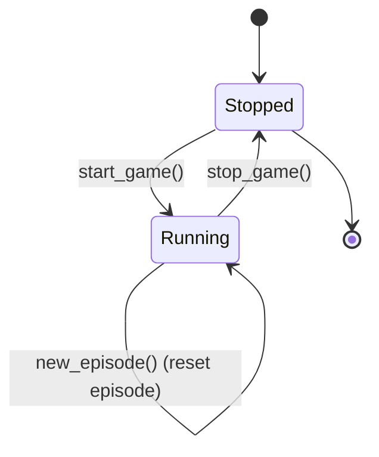
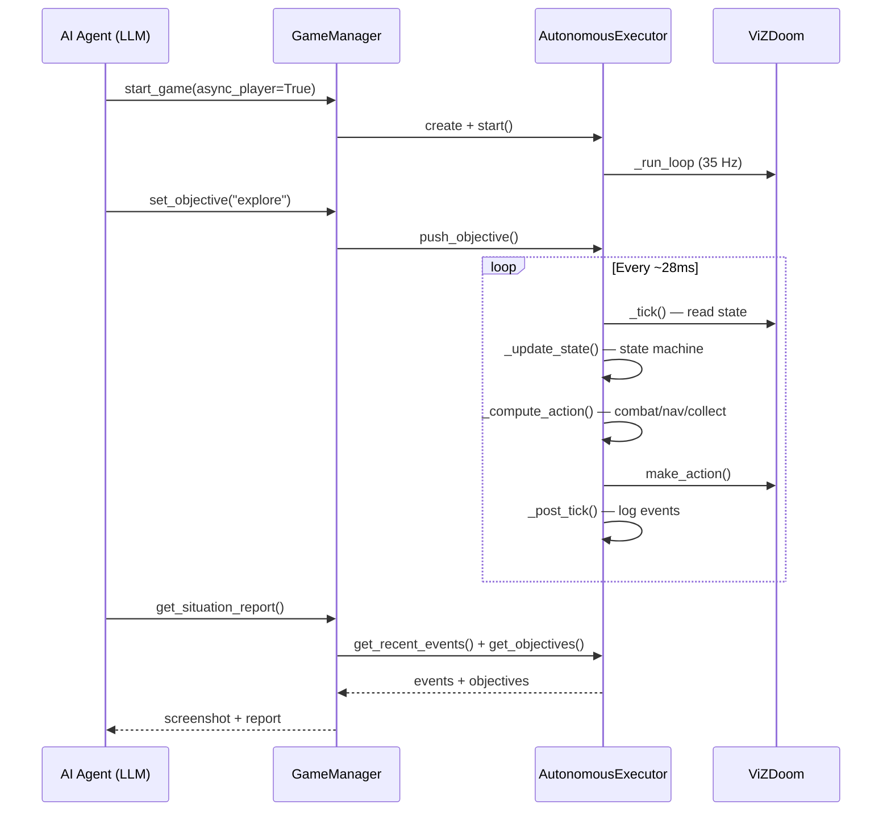
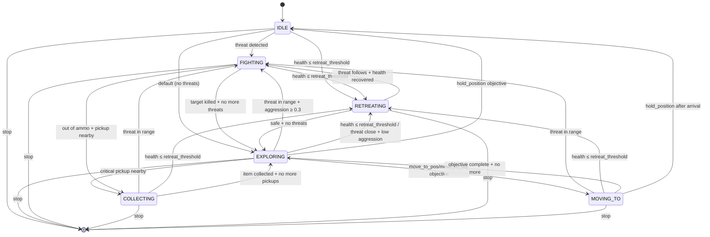
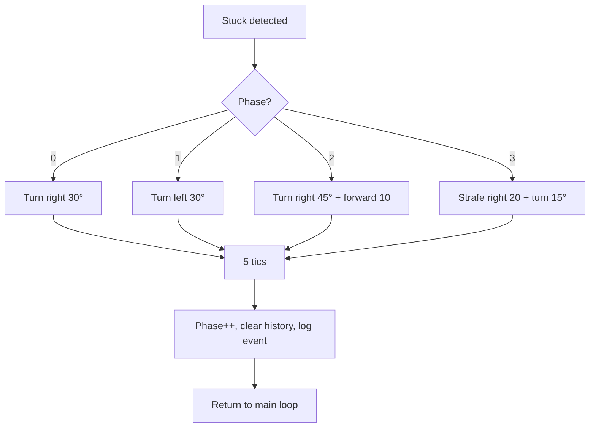

# GameManager & AutonomousExecutor

## GameManager

The `GameManager` class (`game_manager.py:189`) wraps a single ViZDoom `DoomGame` instance and provides the full API surface for game interaction. It is the central coordinator that all MCP tools delegate to.

### Lifecycle



The manager holds a `threading.Lock` (`_game_lock`) for thread-safe access. Compound actions and the autonomous executor both acquire this lock before touching the ViZDoom game instance.

### Lifecycle Methods

**`start(scenario, wad, scenario_wad, map_name, difficulty, buttons, variables, screen_resolution, episode_timeout, render_hud, window_visible, async_player, ticrate, seed, recording_path)`**

Configures and initializes a ViZDoom game:
1. Stops any running game
2. Validates button names against `actions.BUTTON_NAMES` and variable names against `vzd.GameVariable`
3. Resolves the screen resolution enum
4. If WAD mode: resolves IWAD path, optionally loads PWAD via `set_doom_game_path` + `add_game_args`, sets map
5. If scenario mode: loads `.cfg` file from ViZDoom's `scenarios_path`
6. Configures universal settings (RGB24, depth/labels/objects/sectors/automap buffers, mode, skill, seed, timeout)
7. Redirects stdout to stderr during `game.init()` to avoid MCP protocol corruption
8. If `async_player=True`, creates and starts an `AutonomousExecutor`
9. Stores configuration for later use (campaign auto-advance, telemetry)

**`stop()`**

1. Stops the executor (`_executor.stop()`)
2. Calls `game.close()` on the ViZDoom instance
3. Cleans up any temporary runtime WAD files

**`new_episode(recording_path)`**

1. Pauses the executor
2. Checks if the level was completed (`total_reward >= 100.0` = map exit reward). If so, advances to the next map via `next_map()` and `game.set_doom_map()`
3. Calls `game.new_episode()`
4. Resets navigation memory and executor state
5. Resumes the executor

### Single-Player WAD Preparation

When a PWAD has multiple Player 1 start things (e.g. coop or deathmatch maps), ViZDoom may crash or misbehave. `_prepare_single_player_wad()` (`game_manager.py:287`) creates a temporary copy of the WAD with all Player 1 starts (>1) reclassified as Player 11 (deathmatch) starts, leaving exactly one Player 1 start:

```
1. Copy WAD to temp file (doom_mcp_E1M1.wad)
2. Parse THINGS lump for the target map
3. Pick first Player 1 start; rewrite all others to type 11
4. Return temp path as runtime WAD
```

### State Extraction

**`_extract_full_state(game, include_sectors, include_depth)`** (`game_manager.py:339`):

1. Calls `game.get_state()` for the ViZDoom state object
2. Extracts 39 game variables via `state.extract_game_variables()` (vitals, position, combat stats, inventory)
3. Computes player position/angle via `_get_player_pos()`
4. Extracts all objects via `state.extract_objects()` with computed distance and relative angle
5. Filters objects via `_filter_objects()` — removes distant decorations, keeps actionable types (monsters, players, hazards, projectiles, keys, weapons) within range, visible items/ammo nearby
6. Converts screen buffer to PNG via `state.screen_buffer_to_png()`
7. Updates `NavigationMemory` with full object list
8. Optionally extracts sector geometry and depth buffer stats

**`_finished_state(game, reward)`** (`game_manager.py:373`):

Returns episode-finished state with `dead`, `level_completed`, `episode_timeout`, `total_reward`, and campaign-specific info (current map, next map hint, retry hint).

### Game Variables (39 total)

| Category | Variables |
|---|---|
| **Vitals** | `HEALTH`, `ARMOR`, `DEAD`, `ON_GROUND` |
| **Position** | `POSITION_X`, `POSITION_Y`, `POSITION_Z`, `ANGLE`, `PITCH`, `VELOCITY_X/Y/Z` |
| **Combat** | `ATTACK_READY`, `SELECTED_WEAPON`, `SELECTED_WEAPON_AMMO`, `AMMO0`–`AMMO6` |
| **Weapons** | `WEAPON0`–`WEAPON7` (inventory flags) |
| **Stats** | `KILLCOUNT`, `ITEMCOUNT`, `SECRETCOUNT`, `FRAGCOUNT`, `DEATHCOUNT`, `HITCOUNT`, `HITS_TAKEN`, `DAMAGECOUNT`, `DAMAGE_TAKEN` |

### Compound Actions

Compound actions run tight internal game loops that issue per-tic actions to ViZDoom. They operate under `_game_lock` and pause the autonomous executor if it's running. All compound actions support telemetry capture.

#### `aim_and_shoot(object_id, shots=3, max_tics=100)`

```mermaid
flowchart TD
    A[Start] --> B[Find target by ID]
    B --> C{Target exists?}
    C -->|No| D{Any kills?}
    D -->|Yes| E[Stop: target_killed]
    D -->|No| F[Stop: target_lost]
    C -->|Yes| G{Target visible?}
    G -->|No| H[Stop: target_not_visible]
    G -->|Yes| I{Out of ammo?}
    I -->|Yes| J[Stop: out_of_ammo]
    I -->|No| K{Aimed?<br/>(abs(angle) ≤ 3°)}
    K -->|No| L[Turn toward target]
    L --> M[Tick++]
    K -->|Yes| N{Attack ready?}
    N -->|No| O[Wait (noop)]
    O --> M
    N -->|Yes| P[Fire! ATTACK + re-aim]
    P --> Q[Wait cooldown<br/>up to 4 tics]
    Q --> R[shots_fired++]
    R --> S{shots_fired ≥ shots<br/>or tics ≥ max?}
    S -->|No| B
    S -->|Yes| T[Stop: shots_complete/max_tics]
```

Key details:
- Turn clamped to ±45° to prevent overshooting
- Weapon cooldown loop waits up to 4 tics for `ATTACK_READY`
- Tracks `KILLCOUNT`, `HITCOUNT`, `SELECTED_WEAPON_AMMO` deltas for summary

#### `move_to(object_id, max_tics=140, use=false, stop_on_enemy=true)`

```mermaid
flowchart TD
    A[Start] --> B[Record start position]
    B --> C{Episode over?}
    C -->|Yes| D[Stop: player_died/episode_finished]
    C -->|No| E[Track position + update nav]
    E --> F{Target exists?}
    F -->|No| G{Pickup type?}
    G -->|Yes| H[Stop: arrived (collected)]
    G -->|No| I[Stop: target_lost]
    F -->|Yes| J{Distance < 64?}
    J -->|Yes + pickup| K[Approach + collect loop<br/>up to 8 tics]
    K --> L{Collected?}
    L -->|Yes| M[Stop: arrived (collected)]
    L -->|No| N[Stop: pickup_not_collected]
    J -->|Yes + use| O[Press USE + stop: arrived]
    J -->|Yes| P[Stop: arrived]
    J -->|No| Q{Enemy nearby?<br/>(stop_on_enemy)}
    Q -->|Yes| R[Stop: enemy_nearby]
    Q -->|No| S{Stuck?<br/>(spread < 15 over 20 tics)}
    S -->|Yes, ≤3 recoveries| T[Strafe + turn recovery<br/>alternating L/R]
    T --> U[Push forward]
    U --> V[Clear history + continue]
    S -->|Yes, >3 recoveries| W[Stop: stuck]
    S -->|No| X{Angle > 15°?}
    X -->|Yes| Y[Turn only (no forward)]
    X -->|No| Z[Turn + forward]
    Y --> AA
    Z --> AA
    AA[Tick++] --> C
```

Stuck recovery is a 3-phase cycle per compound action:
1. Strafe 20 units + turn 25° in one direction (3 tics)
2. Push forward 4 tics
3. If still stuck after 3 recovery attempts, stop with `"stuck"` reason

#### `explore(max_tics=200, stop_on_enemy=true, stop_on_item=false)`

Uses depth buffer for wall avoidance with hysteresis:

1. Reads the depth buffer (H×W, 0–255 scale)
2. Divides into horizontal thirds (left/center/right) and a middle band
3. If `center < 15` (close wall): hard turn away from the closer side (±25° bias)
4. If `center < 40` (near wall): gentle turn + slow forward (±10° bias, speed 15)
5. If `center >= 40` (clear): decay turn bias by 0.5× per tic, full speed (25)
6. Stuck detection with recovery (same as `move_to`)
7. Scans all objects for new monsters (within 800 units) and items — stops on first sighting if configured

Direction tracking prevents oscillation: `turn_bias` is stored across iterations with hysteresis decay.

#### `strafe_and_shoot(object_id, direction="auto", shots=5, max_tics=100)`

- Alternates strafe direction every ~15 tics in `"auto"` mode
- Always tries to fire when `ATTACK_READY`, even if not perfectly aligned (trades accuracy for DPS)
- Tracks `DAMAGE_TAKEN` delta in addition to standard combat stats
- Weapon cooldown: instead of waiting, strafes while re-aiming

#### `retreat(tics=35, backpedal=false)`

- **Backpedal mode (`backpedal=true`)**: moves backward at speed 25 with SPEED flag for `tics` — maintains line of sight, ~60% of forward speed
- **Turn-and-run mode (`backpedal=false`, default)**: turns right 30°/tic for 6 tics (~180°), then sprints forward with SPEED flag — ~2× faster escape

### Director API

The director API provides tools for an LLM to supervise the autonomous executor without low-level per-tic commands.

#### `get_threat_assessment()` (`game_manager.py:1588`)

Prioritizes threats using a scoring formula:

```
score = threat_weight × 10 + attack_urgency × 5 + proximity (1000/dist) + visibility_bonus (5 if visible)
```

Archvile gets +100 bonus (always top priority). Overall threat level is determined by top score thresholds (critical ≥ 50, high ≥ 30, medium ≥ 15, else low).

Generates tactical advice strings for: priority target identification, low health warnings, no ammo alerts, incoming projectile dodge warnings, hitscan group warnings.

#### `get_situation_report()` (`game_manager.py:1739`)

Returns a consolidated snapshot for the director: executor state, objectives queue, strategy parameters, recent events (since last call), filtered objects, exploration summary. Includes a screenshot.

#### `set_objective()` / `set_strategy()`

See [tools.md](tools.md#17-set_objective) for full parameter docs.

### Telemetry System

Compound actions and `take_action` support optional telemetry capture. When enabled:

1. `_telemetry_frames` list is initialized empty
2. After each group of tics (at `telemetry_stride`), a frame sample is captured: `tic`, `game_variables`, `episode_finished`, `level_completed`, `map_exit`, and a base64-encoded screenshot
3. On completion, frames are attached to the result as `telemetry_frames[]`
4. Used by recording workflows to reconstruct gameplay footage

### Campaign Mode

Campaign progression is handled through `game_setup.next_map()`:

- **Doom 2 format** (MAP01–MAP32): advances `MAP01 → MAP02 → ... → MAP32`
- **Doom 1 format** (E1M1–E4M9): advances `E1M1 → E1M2 → ... → E4M9`

On `new_episode()`, if the player is not dead and `total_reward >= 100.0` (the map exit reward set by `game.set_map_exit_reward(100.0)`), the manager sets the next map before calling `game.new_episode()`.

---

## AutonomousExecutor

The `AutonomousExecutor` class (`executor.py:115`) runs a background thread that plays Doom autonomously at game speed (~35 Hz). The LLM acts as a high-level director, setting objectives and tuning strategy via MCP tools while the executor handles moment-to-moment gameplay.

### Architecture



### State Machine



### Per-Tick Loop (`_tick`, `executor.py:349`)

Each tick executes in three phases:

**Phase 1 — Read State** (under `_game_lock`): Acquires a `_TickSnapshot` with position, health, armor, ammo, weapon, attack readiness, depth buffer, all objects. Classifies threats and items.

**Phase 2 — Decide** (no lock): Runs `_update_state()` (state machine transition) then `_compute_action()` (action computation based on current state).

**Phase 3 — Apply** (under `_game_lock`): Calls `game.make_action()` with the computed action vector, then updates navigation memory.

### Combat System (`_fight_action`, `executor.py:567`)

- **Target selection**: Uses `_current_target_id` for persistence; falls back to highest-priority threat
- **Target priority scoring**:
  ```
  score = threat_weight × 10 + attack_urgency × 5 + proximity (1000/dist) + 5
  ```
  Where `threat_weights = {none: 0, low: 1, medium: 2, high: 3}` and `attack_urgency = {hitscan: 3, projectile: 2, melee: 1, none: 0}`.
  Archvile gets +100 bonus.
- **Aiming**: Clamped turn at ±45°/tic with 5° tolerance for firing
- **Dodge strafe**: Alternates left/right every 20 tics at 15 units/tic
- **Melee backpedal**: Reverses at 15 units/tic when a melee enemy is within 200 units
- **Weapon switching**: Auto-switches via `SELECT_NEXT_WEAPON` when out of ammo

### Exploration (`_explore_action`, `executor.py:617`)

Identical depth-buffer wall avoidance algorithm to the compound `explore()` action:
- Center band analysis with left/center/right third comparison
- Hard turn (25°) on imminent collision (center < 15)
- Gentle turn (10°) + slow forward (15 speed) when near (center < 40)
- Bias decay when clear (0.5× per tic)

### Navigation (`_move_to_action`, `executor.py:726`)

For `MOVE_TO_POS` and `MOVE_TO_OBJ`/`USE_OBJECT` objectives:
1. Resolves target coordinates from objective params or object list
2. Computes angle-to-target using `atan2`, normalized to ±180°
3. Arrival detection at 64 units
4. Clamped turn at ±45°, forward movement when within 30° of target angle

### Stuck Detection (`_is_stuck`, `executor.py:555`)

```
Position history window: 20 tics
Stuck threshold: spread < 15 map units
(spread = bounding-box diagonal of position history)
```

When stuck and not in `IDLE` or `FIGHTING` state, enters a **4-phase recovery cycle**:



Each phase runs for 5 tics before advancing. After phase 3, wraps back to phase 0. Position history is cleared after each recovery attempt.

### Thread Safety

| Mechanism | Purpose |
|---|---|
| `_game_lock` (threading.Lock) | Held during ViZDoom game state read/write. Compound actions and executor both acquire it |
| `_paused` (threading.Event) | Set = running, cleared = paused. The executor's main loop blocks on `_paused.wait()` when paused |
| `_pause_ack` (threading.Event) | Acknowledgment signal — the pause caller waits up to 2s for the executor to confirm pause |
| `_director_lock` (threading.Lock) | Protects objectives, strategy, and events from concurrent director tool access |
| `_stop_flag` (threading.Event) | Signals the executor to exit its main loop |

### Strategy Parameters

Strategy is copied per-tick via `_get_strategy_copy()` to prevent mid-tick mutation:

| Parameter | Default | Range | Effect |
|---|---|---|---|
| `aggression` | `0.5` | 0.0–1.0 | At ≥ 0.3, executor fights threats in range; below, retreats from distant threats |
| `health_retreat_threshold` | `20` | 0–100 | Always retreat when HP ≤ threshold |
| `health_collect_threshold` | `50` | 0–100 | Seek health items when HP ≤ threshold |
| `ammo_switch_threshold` | `5` | 0–100 | Auto-switch weapon when ammo ≤ threshold |
| `engage_range` | `1500` | any | Max distance to engage enemies |
| `collect_range` | `800` | any | Max distance to collect items |
| `prefer_cover` | `false` | bool | (Reserved for future cover-seeking behavior) |

---

## NavigationMemory

The `NavigationMemory` class (`navigation.py:18`) tracks spatial exploration state across tics within a single episode.

### Grid-Based Cell Tracking

MCP navigation uses its own internal 128×128 unit cells. This is intentionally
separate from the backend's 256-unit QA coverage grid. Each tick, the player's
current MCP-navigation cell `(int(x)//128, int(y)//128)` is added to a visited
set:
- `cells_explored`: size of the visited set
- `explored_directions` / `unexplored_directions`: checks the 4 cardinal neighbors of the current cell
- `suggested_direction`: picks the unexplored direction closest to the player's facing angle

### Key Pickup Detection

Keys are tracked by object ID. When a key object disappears from the object list and the player is within 64 units of its last known position, it's recorded as picked up (`keys_found`). Known key locations are maintained for keys that haven't been picked up yet.

### Door Detection from Sector Geometry

Doors are detected by analyzing sector geometry when sector data is available:
- Sectors with small ceiling-floor gaps (< 8 units) are potential doors
- Sector bounding box diagonal must be < 256 units (small sector = likely door)
- Deduplication merges doors within 128 units
- Door state tracked as `"closed"` (gap < 4) or `"partially_open"`

### Exploration Direction Analysis

8 cardinal directions are checked relative to the player's current cell: north, south, east, west. The suggested direction is the unexplored cardinal direction most closely aligned with the player's facing angle (Doom convention: 0° = east, 90° = north, 180° = west, 270° = south).
