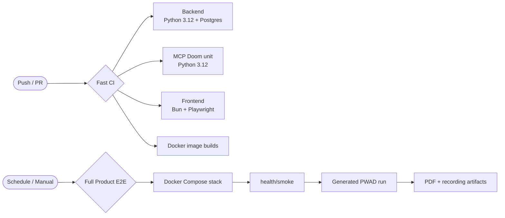

# CI/CD Pipeline

## Fast CI

Fast CI lives in `.github/workflows/ci.yml` and runs on every push and pull request.

| Job | Main checks |
|---|---|
| Backend | Python 3.12, dependency install, `pytest -q`, fresh PostgreSQL `alembic upgrade head`, `alembic current`, `alembic check` |
| MCP Doom | Python 3.12, editable install, `pytest -q -m "not integration"` |
| Frontend | Bun 1.3, `bun ci`, Playwright Chromium install, `bun run test`, `bun run lint`, `bun run build`, Playwright against the built app |
| Docker | Build backend, MCP Doom, and frontend images |

Fast CI is deterministic and does not require paid Gemini calls.

## Full Product E2E

Full e2e lives in `.github/workflows/full-e2e.yml` and runs nightly or manually.

The workflow:

1. Builds and starts `docker-compose.yml`.
2. Waits for backend health.
3. Runs `/health/smoke`; a missing Gemini key is treated as deterministic fallback mode.
4. Generates a temporary PWAD from bundled Freedoom in the MCP container.
5. Uploads that PWAD, starts a short run, waits for terminal status, and verifies report PDF and MP4 recording endpoints.
6. Uploads JSON responses, PDF, recording, and compose logs as artifacts.

## Runtime Notes

- Docker Compose binds service ports to `127.0.0.1`.
- Scheduled/manual e2e uses `GEMINI_API_KEY` when available, but does not require it for deterministic smoke coverage.
- MCP integration tests still require ViZDoom runtime libraries and should run under `xvfb` in headless environments.
