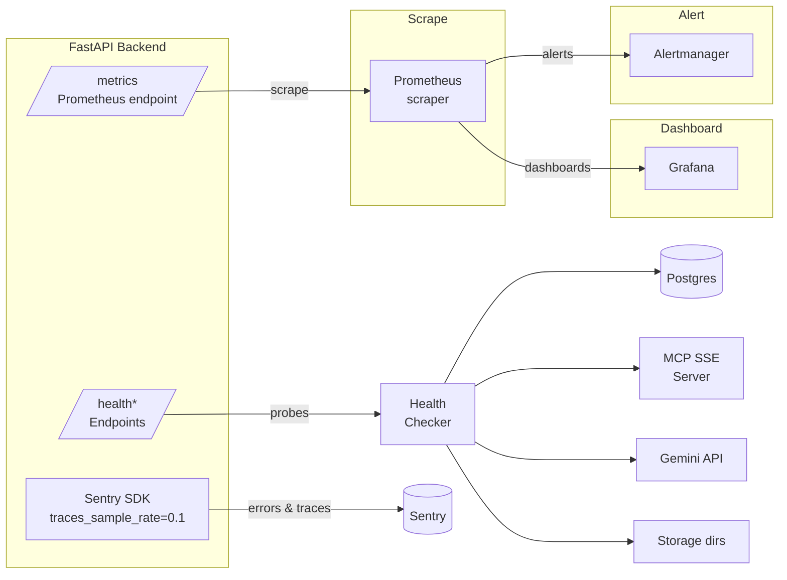

# Monitoring & Health Checks



## Prometheus Metrics

Exposed at `GET /metrics` via `prometheus_client`. All metrics registered in `app/core/metrics.py`.

| Metric | Type | Labels | Description |
|---|---|---|---|
| `runs_total` | Counter | `outcome`, `status` | Total test runs created |
| `runs_active` | Gauge | — | Currently active (pending/running/analyzing) runs |
| `llm_calls_total` | Counter | `outcome` | Total LLM API calls |
| `llm_latency_seconds` | Histogram | — | LLM call latency (buckets: 0.5, 1, 2, 5, 10, 30, 60) |
| `mcp_calls_total` | Counter | `tool` | Total MCP tool calls |
| `mcp_latency_seconds` | Histogram | — | MCP tool latency (buckets: 0.1, 0.5, 1, 2, 5, 10, 30) |
| `defects_found_total` | Counter | `defect_type` | Total defects found |

## Health Endpoints

### `GET /health`

Simple liveness check.

```json
{ "status": "ok" }
```

### `GET /health/gemini`

Probes the configured Gemini model via `GeminiService.probe_model()`.

```json
{ "status": "ok", "model": "gemini-2.5-flash-lite", "response": "..." }
```

### `GET /health/mcp`

Checks MCP SSE URL reachability via `probe_mcp_sse_url()`.

```json
{ "status": "ok", "reachable": true }
```

### `GET /health/smoke`

Full integration smoke test via `SmokeService.run_smoke()` — exercises MCP connectivity, game start, and state fetch. If `GEMINI_API_KEY` is configured it also probes the Gemini model; otherwise the Gemini stage is marked as skipped because deterministic fallback mode is available. Returns HTTP 200 if overall is `"pass"`, 503 otherwise.

### `GET /health/detailed`

Comprehensive dependency check with per-component status:

| Component | Check |
|---|---|
| `postgres` | `SELECT 1` query |
| `mcp` | SSE URL probe |
| `gemini` | API key presence (non-empty) |
| `storage` | All 6 storage dirs exist and are writable |
| `run_status` | Count of runs with `pending`, `analyzing`, or `running` status |

Returns `"status": "ok"` when all components pass, `"degraded"` otherwise.

## Error Tracking

### Sentry

Initialised in the FastAPI `lifespan` handler if `sentry_sdk` is installed and `SENTRY_DSN` is configured.

| Setting | Value |
|---|---|
| `traces_sample_rate` | `0.1` |
| Environment | `"production"` if `debug=False`, else `"development"` |

### Orphaned Run Detection

On server startup, the lifespan handler calls `fail_orphaned_active_runs(db, reason="Orphaned by server restart")`. Any `TestRun` with status `pending`, `running`, or `analyzing` that has no corresponding in-process task is marked as:

| Field | Value |
|---|---|
| `outcome` | `error` |
| `failure_category` | `infrastructure` |
| `failure_stage` | `orphaned_run` |

### Failure Categorization

Runs can be categorised by `failure_category`:

| Category | Meaning |
|---|---|
| `pwad_crash` | PWAD caused a crash/exception during execution |
| `infrastructure` | Infrastructure error (orphaned run, service unavailable, etc.) |
| *(null/other)* | Normal run completion without categorised failure |
