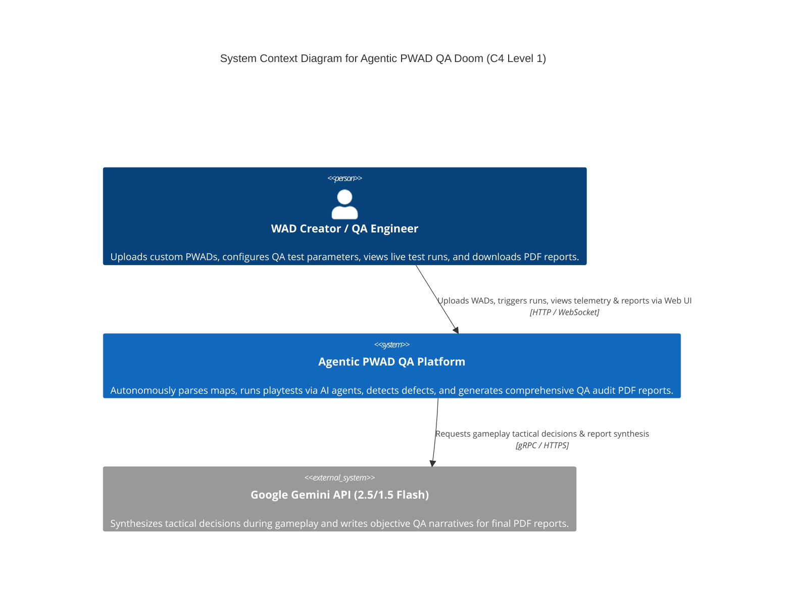
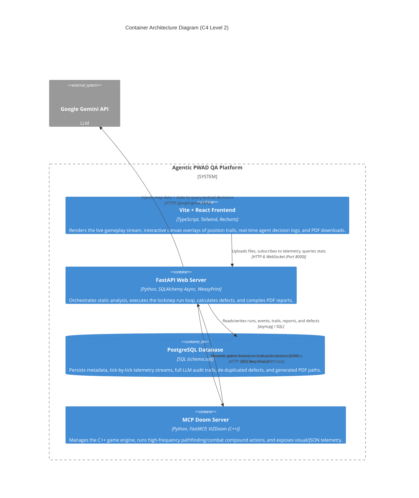
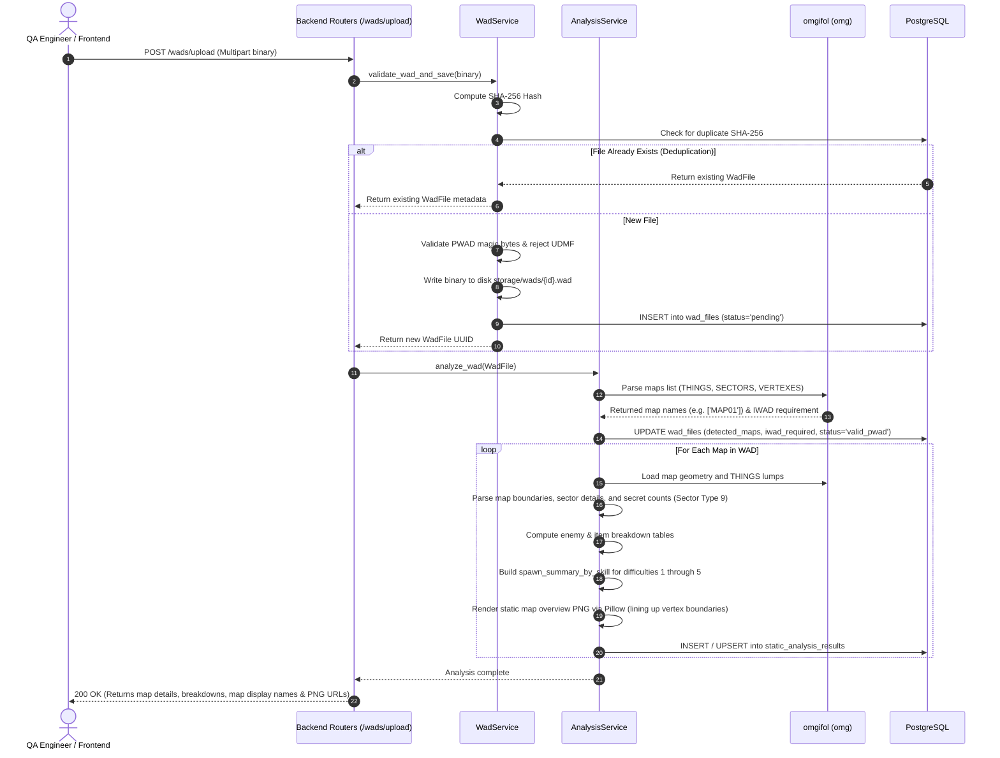
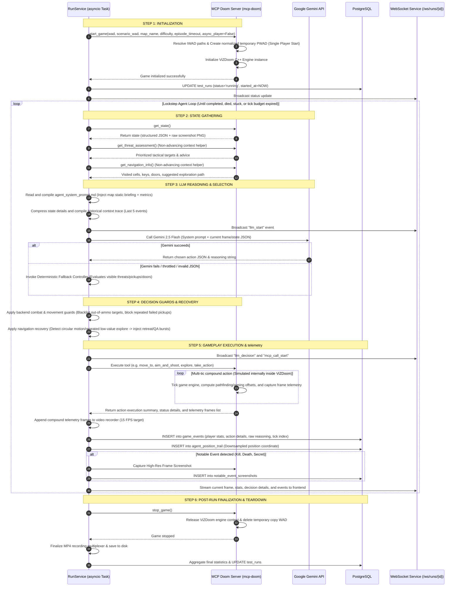
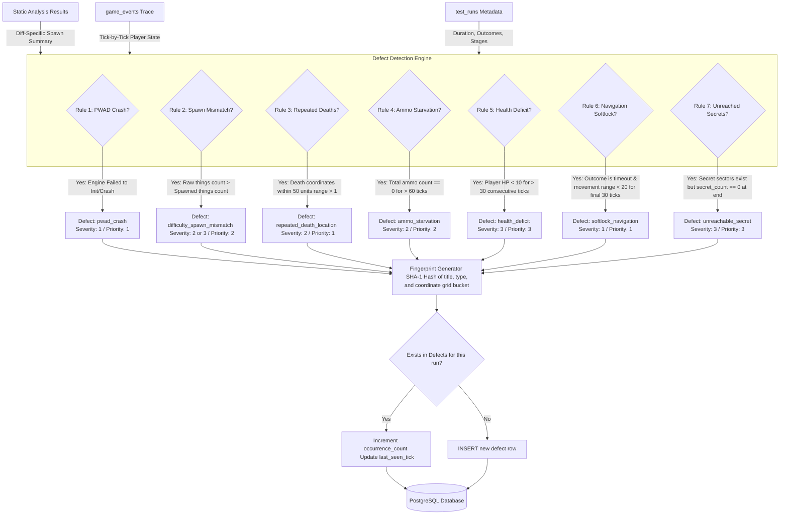
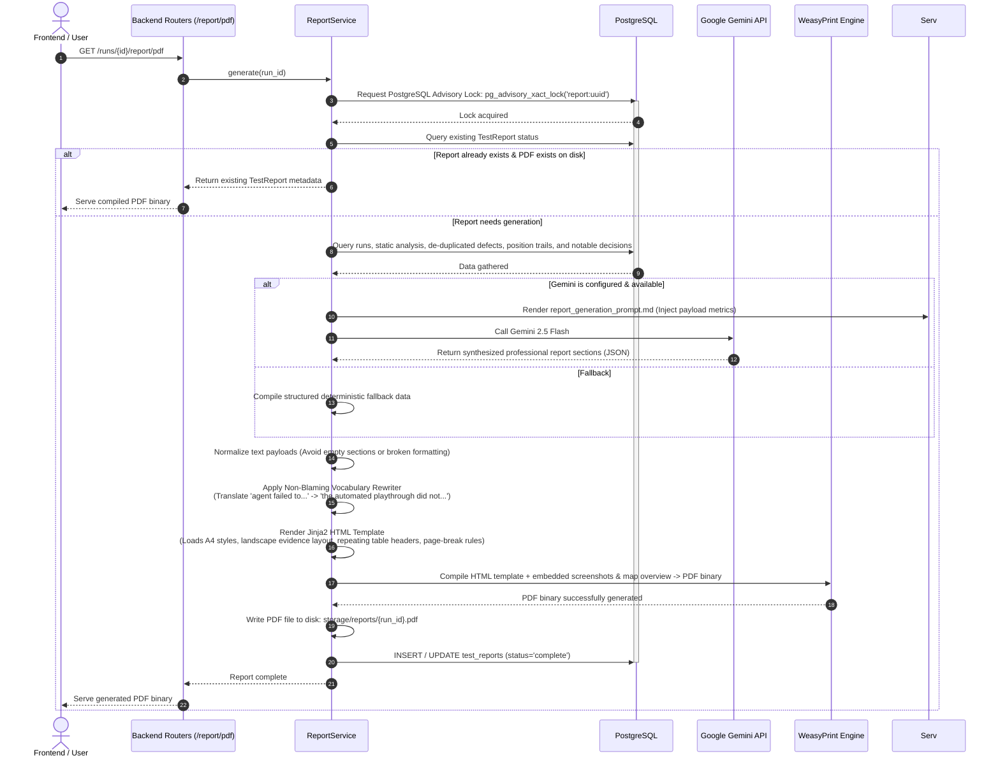

# The Whole Shit Till Now: Architectural Specification & System Blueprint

Welcome to the definitive, developer-level documentation for the **Agentic PWAD QA Doom** platform. This document outlines the core vision, architectural patterns, dataset schemas, live execution pipelines, and file trees for the entire system, detailing how everything works under the hood. It includes comprehensive software engineering diagrams utilizing Mermaid syntax and a highly critical evaluation of current architectural limitations, along with recommendations to make the project perfect.

---

## 1. System Vision & Core Concept

### The Problem
Doom's modding community has produced tens of thousands of custom levels (PWADs - Patch WADs) over the last three decades. Ensuring these maps are playable, balanced, free of progression blockers (softlocks), and correctly configured across multiple difficulty levels (skills) requires extensive human playtesting. Human testing is time-consuming, expensive, and subject to cognitive fatigue, which often leads to missed bugs.

### The Solution: Agentic PWAD QA Doom
This platform is an autonomous, non-destructive, closed-loop QA testing suite that replaces human playtesters with a **hybrid AI agent**. It acts as an automated "QA tester in a box." 

Rather than executing purely random movements (fuzzing) or following static scripts, the system combines:
1.  **High-Level Strategic Reasoning:** Powered by a state-of-the-art Multi-Modal Large Language Model (Google Gemini 1.5/2.5 Flash) that understands map properties, analyzes visual frames, maintains lockstep state memory, and makes tactical decisions.
2.  **Low-Level High-Frequency Execution:** Controlled by an algorithmic controller inside a specialized **Model Context Protocol (MCP)** server wrapping a headless **ViZDoom** (C++ Doom engine) instance.

The system accepts a PWAD upload, extracts its geometry and balance metrics via static analysis, executes playtests in a headless Doom instance under lockstep control, streams real-time telemetry over WebSockets, calculates post-mortem defects, and compiles an audit-grade PDF report with complete video/screenshot evidence.

---

## 2. System Context & Container Architecture

The system uses a highly decoupled three-tier architecture:
*   **The Frontend UI:** A modern React application that visualizes the real-time agent gameplay stream, displays live scrolling reasoning logs, overlays coordinate trails on interactive map canvases, and serves PDF report downloads.
*   **The Backend Web Server:** A high-performance FastAPI web service that manages database states, orchestrates static analysis, coordinates the lockstep playtest loop, calculates defects, and compiles PDF reports.
*   **The MCP Doom Server (`mcp-doom`):** A FastMCP service that manages the local C++ ViZDoom process. It exposes game-vitals as tools and runs high-frequency compound actions (e.g., pathfinding, wall avoidance, aiming, and firing) in milliseconds to avoid latency between LLM decisions.

### 2.1 System Context (C4 Level 1)



### 2.2 Container Architecture (C4 Level 2)



---

## 3. Database Schema & Relational Model

The database is built on **PostgreSQL** using timezone-aware timestamps, UUID primary keys for external resources, and optimized `BIGSERIAL` keys for high-frequency internal streams (`game_events` and `agent_position_trail`).

### Complete Entity-Relationship Diagram (ERD)

```mermaid
erDiagram
    WAD_FILES ||--o{ STATIC_ANALYSIS_RESULTS : "analyzed for maps"
    WAD_FILES ||--o{ TEST_RUNS : "tested in"
    STATIC_ANALYSIS_RESULTS ||--o{ TEST_RUNS : "defines starting context for"
    TEST_RUNS ||--|| TEST_REPORTS : "generates exactly one"
    TEST_RUNS ||--o{ GAME_EVENTS : "records ticks inside"
    TEST_RUNS ||--o{ AGENT_POSITION_TRAIL : "samples coordinate paths in"
    TEST_RUNS ||--o{ NOTABLE_EVENT_SCREENSHOTS : "captures visual moments in"
    TEST_REPORTS ||--o{ DEFECTS : "contains de-duplicated findings"
    GAME_EVENTS ||--o{ NOTABLE_EVENT_SCREENSHOTS : "triggers visual snapshots at"
    NOTABLE_EVENT_SCREENSHOTS ||--o? DEFECTS : "visually proves"

    WAD_FILES {
        uuid id PK
        varchar original_filename
        text stored_path "Absolute path on disk"
        bigint file_size_bytes
        char sha256_hash "Unique file deduplication"
        timestamptz uploaded_at
        varchar validation_status "pending | valid_pwad | valid_iwad | invalid | udmf_unsupported"
        text validation_error
        text_array detected_maps "e.g. ['MAP01', 'MAP02']"
    }

    STATIC_ANALYSIS_RESULTS {
        uuid id PK
        uuid wad_file_id FK
        varchar map_name "e.g. MAP01, E1M1"
        integer thing_count_total
        integer thing_count_enemies
        integer thing_count_items
        integer thing_count_keys
        integer thing_count_weapons
        integer linedef_count
        integer sector_count
        integer secret_sector_count
        integer vertex_count
        integer map_width_units
        integer map_height_units
        integer total_monster_hp
        integer total_health_pickup_pts
        integer total_armor_pickup_pts
        numeric hitscanner_percent
        numeric health_ratio
        numeric ammo_ratio
        varchar estimated_difficulty "easy | fair | hard | slaughter"
        jsonb enemy_breakdown "Keyed by type"
        jsonb item_breakdown "Keyed by item class"
        text map_overview_png_path "Absolute path on disk"
        jsonb spawn_summary_by_skill "Diff-specific spawns 1-5"
        varchar map_title "Parsed from MAPINFO"
        varchar map_display_name
        varchar map_title_source "mapinfo | umapinfo | fallback_filename"
        timestamptz analyzed_at
    }

    TEST_RUNS {
        uuid id PK
        uuid wad_file_id FK
        uuid static_analysis_id FK
        varchar map_name
        smallint difficulty_level "1 to 5"
        varchar iwad_used "e.g. freedoom2"
        varchar llm_model
        varchar status "pending | running | completed | failed | cancelled"
        timestamptz started_at
        timestamptz completed_at
        integer duration_seconds
        varchar outcome "map_completed | player_died | timeout | stuck | pwad_crash | cancelled"
        text error_message
        smallint final_hp
        smallint final_armor
        smallint total_kills
        smallint total_deaths
        smallint secrets_found
        smallint total_items_collected
        integer total_actions_taken "Total MCP compound actions"
        integer total_llm_calls
        integer max_ticks "Hard ceiling 35,000"
        text recording_mp4_path
        text report_pdf_path
        jsonb recording_metadata "Video file validation details"
        jsonb progress_metrics "QA audit coverage statistics"
        jsonb agent_quality_flags "Combat/pickup safety diagnostics"
        varchar failure_category "pwad_crash | runtime_error"
        varchar failure_stage "startup | gameplay | report"
        text failure_summary
        text failure_diagnostics
        timestamptz created_at
    }

    GAME_EVENTS {
        bigint id PK
        uuid run_id FK
        integer tick_number "ViZDoom episode tic"
        timestamptz recorded_at
        real player_x
        real player_y
        smallint player_angle
        smallint health
        smallint armor
        smallint ammo_bullets
        smallint ammo_shells
        smallint ammo_rockets
        smallint ammo_cells
        smallint kill_count
        smallint item_count
        smallint secret_count
        smallint weapon_selected
        jsonb action_taken "mcp_tool, mcp_params, etc."
        text llm_reasoning "Raw chain-of-thought"
        text llm_input_summary "Compressed snapshot sent to Gemini"
        varchar event_type "normal | kill | death | item_pickup | secret_found | damage_taken | map_exit | stuck"
        varchar killed_enemy_type
        smallint damage_received
        uuid agent_decision_id FK "Link to full audit card"
    }

    AGENT_POSITION_TRAIL {
        bigint id PK
        uuid run_id FK
        integer tick_number "Downsampled every 10 tics"
        real x
        real y
        smallint health
    }

    NOTABLE_EVENT_SCREENSHOTS {
        uuid id PK
        uuid run_id FK
        bigint game_event_id FK
        text screenshot_path "Absolute path to PNG"
        timestamptz captured_at
    }

    TEST_REPORTS {
        uuid id PK
        uuid run_id FK "Unique constraint"
        text report_purpose
        text intended_audience
        text problem_and_escalation
        text test_items_summary
        text test_environment_summary
        jsonb hardware_spec
        jsonb software_spec
        text variances_from_plan
        text test_procedure_variances
        text test_case_variances
        text test_coverage_evaluation
        jsonb objectives_planned
        jsonb objectives_covered
        jsonb objectives_omitted
        text uncovered_attributes
        text test_process_changes
        text defect_summary_narrative
        text defect_patterns
        text test_item_limitations
        text dropped_features
        jsonb pass_fail_summary
        jsonb risk_areas
        jsonb good_quality_areas
        text major_activities_summary
        text activity_variances
        integer elapsed_time_seconds
        integer total_actions_taken
        text pdf_path
        timestamptz generated_at
        varchar generation_status "generating | complete | failed"
        text generation_error
    }

    DEFECTS {
        uuid id PK
        uuid run_id FK
        uuid report_id FK
        smallint severity "1=Critical, 2=Major, 3=Minor, 4=Trivial"
        smallint priority "1=High, 2=Medium, 3=Low"
        varchar resolution_status "open | resolved | deferred"
        varchar defect_type "pwad_crash | difficulty_spawn_mismatch | repeated_death_location | ammo_starvation | health_deficit | softlock_navigation | unreachable_secret"
        varchar title
        text description
        text reproduction_steps
        integer detected_at_tick
        real position_x
        real position_y
        uuid screenshot_id FK
        text recommendation
        char fingerprint "Stable de-duplication hash"
        integer occurrence_count
        timestamptz created_at
    }
```

---

## 4. Map Processing Pipeline (Static Analysis)

When a PWAD is uploaded, the platform initializes a series of steps to parse raw binary blocks into digestible analytical datasets:



### Static Analysis Details
*   **WAD Parsing (`omgifol` & `omg`):** Python library that loads raw binary chunks into a manageable structure. It lists map headers (e.g., `MAP01` or `E1M1`), counts entity indices, reads sectors to extract secrets (Sector Type 9), and parses coordinates.
*   **Title Parsing (`MAPINFO`/`UMAPINFO`):** The system extracts mappers' custom names for the maps (e.g., `"The Long Hallways"`) by parsing inline or bracketed config blocks inside text lumps. If missing, it falls back to the filename prefix and map name.
*   **Balance Heuristics (`analysis_service.py`):**
    *   **Monster HP vs. Pickup Points:** It maps every enemy type to its canonical HP value and compares the sum with all spawnable health/armor pickups to calculate difficulty and resource balance.
    *   **Ammo Ratio:** Compares ammo pickup capacity values with total monster HP to evaluate potential ammo starvation before the playtest starts.
    *   **Difficulty Flags:** Doom maps contain flag tags that determine whether an entity spawns at Easy, Medium, Hard, or Multiplayer settings. The system compiles a dedicated `spawn_summary_by_skill` dictionary mapping difficulties 1 to 5, which serves as starting context for the testing agent.

---

## 5. Lockstep Autonomous Playtest Engine

The system uses a **lockstep execution loop** to test gameplay. By starting the game in `async_player=False` (PLAYER mode), the game engine is treated as a turn-based system. Time (tics) only advances when the backend executes a tool. This ensures the agent does not stand idle or get killed while the LLM generates tactical decisions.



### Self-Verification, Guards, & Recovery Systems
To make the automated player highly stable during lockstep execution, the `RunService` applies several layers of guards:
1.  **Combat Target Guards:** Fire actions are only executed against targets that are currently visible. If the model attempts to fire at an out-of-sight enemy, the system overrides the action to exploration and logs a guard warning.
2.  **Out-of-Ammo Safeguards:** If a combat action returns `out_of_ammo`, the system logs the target ID and blocks further combat actions against that ID until the agent switches weapons, collects resources, or retreats.
3.  **Pickup Collection Guards:** When `move_to` is called on a pickup, the action is only marked as successful once the item is removed from the engine's active object list. If collection fails (due to blocked pathing), the system blocks the agent from re-targeting that item unless new objects appear in the environment.
4.  **Stuck Recovery Controller:** The system tracks agent positions. If the agent remains in the same coordinates across several steps, it overrides the LLM with a recovery controller that triggers a short `retreat` or `explore` action in a different direction.
5.  **Low-Value Explore Override:** If the agent triggers repeated `explore` calls that result in no progress (e.g., getting stuck in a corner), the system interrupts the loop and executes a specialized QA probe burst (e.g., turning, moving, and using switches) to attempt to unlock progress.

---

## 6. Defect Detection Pipeline

Once a run reaches a terminal state, the platform's `DefectService` applies deterministic pattern-matching rules against the static map data and the tick-by-tick `game_events` trace.



### Fingerprinting & De-duplication
To prevent reports from becoming cluttered with repetitive logs (e.g., getting stuck in a corner and logging a "stuck" defect every second), the system generates a stable SHA-1 **fingerprint** for each defect. 

The fingerprint is based on the defect's title, type, and coordinate grid bucket (rounded to 50-unit regions). If a defect with the same fingerprint already exists for the run, the database simply increments its `occurrence_count` and updates its `last_seen_tick`.

---

## 7. QA Report & PDF Synthesis (WeasyPrint)

The final deliverable is an audit-grade PDF report. Because generation can be resource-intensive, the backend applies an advisory lock to prevent race conditions during concurrent requests.



### Non-Blaming Vocabulary Rewriter
To ensure the final generated PDF maintains a professional and objective tone, the `ReportService` automatically runs all LLM-generated text through a regex rewriter. This rewriter translates subjective, action-oriented phrases into neutral, system-oriented descriptions:
*   *“The agent failed to find the switch”* $\rightarrow$ *“The automated playthrough did not reach the switch.”*
*   *“The agent was unable to survive the encounter”* $\rightarrow$ *“The automated playthrough concluded during combat.”*
*   *“The agent could not open the blue door”* $\rightarrow$ *“The blue door was not opened.”*

### PDF Presentation Layout (WeasyPrint)
The PDF report is generated using **WeasyPrint** (which compiles HTML+CSS directly to PDF) and features a polished, presentation-ready design:
*   **Portrait Executive Summary:** A clean, high-level summary of WAD details, system parameters, and defect trends.
*   **Landscape Evidence Appendix:** Wide-table layouts for decision cards, player position trails, and event timelines, ensuring data remains readable.
*   **Print-Media CSS Rules:** Uses CSS page break controls (`page-break-inside: avoid`), repeating table headers across page boundaries, wrapped cells, and styled pass/fail badges for key test cases.

---

## 8. Directory & Implementation File Map

### 8.1 `@Backend/` (FastAPI Web Service)
This is the core Python application under `Backend/app/`.

```text
Backend/
├── app/
│   ├── core/
│   │   ├── config.py             # Config loader; maps environment variables and resolves relative storage directories.
│   │   └── database.py           # Database engine setup; manages async sessions.
│   ├── models/                   # SQLAlchemy declarative database schemas
│   │   ├── agent_decision.py     # Schema for agent actions, decisions, reasoning logs, and timings.
│   │   ├── agent_position_trail.py # Schema for coordinate sampling for canvas drawing and overlays.
│   │   ├── defect.py             # Schema for de-duplicated defects with occurrence counters.
│   │   ├── game_event.py         # Schema for tick-by-tick logs of health, armor, ammo, position, and event categories.
│   │   ├── notable_event_screenshot.py # Schema for visual evidence paths.
│   │   ├── static_analysis_result.py # Schema for map properties, items, HP balance, and skill spawn summaries.
│   │   ├── test_report.py        # Schema for structured reports (purpose, environment details, risk areas).
│   │   ├── test_run.py           # Schema for run configurations, metrics, and failure diagnostics.
│   │   └── wad_file.py           # Schema for uploaded binary metadata and validation tracking.
│   ├── prompts/                  # Directory for standalone prompt text assets
│   │   ├── agent_system_prompt.md # Base prompt for the agent; injected with map details at run start.
│   │   └── report_generation_prompt.md # Instructs Gemini how to compile JSON payloads into QA sections.
│   ├── repositories/             # Interface layer encapsulating SQL mutations
│   │   ├── agent_decision_repository.py
│   │   ├── analysis_repository.py
│   │   ├── defect_repository.py
│   │   ├── game_event_repository.py
│   │   ├── report_repository.py
│   │   ├── run_repository.py
│   │   └── wad_repository.py
│   ├── routers/                  # API HTTP endpoint controllers
│   │   ├── analysis.py           # Routes for WAD details, map lists, and static analysis outputs.
│   │   ├── reports.py            # Routes for JSON report metadata and PDF download triggers.
│   │   ├── runs.py               # Routes for run creation, historical list queries, and cancellation triggers.
│   │   ├── wads.py               # Routes for binary uploads, hash tracking, and overview PNG rendering.
│   │   └── ws.py                 # Route for real-time WebSocket state streaming.
│   ├── serializers/              # Pydantic schemas validating API inputs and outputs
│   │   ├── agent_decision_serializers.py
│   │   ├── analysis_serializers.py
│   │   ├── defect_serializers.py
│   │   ├── game_event_serializers.py
│   │   ├── report_serializers.py
│   │   ├── run_serializers.py
│   │   └── wad_serializers.py
│   ├── services/                 # Main Business Logic services
│   │   ├── analysis_constants.py # Constant mapping of Doom class IDs to HP, categories, and identifiers.
│   │   ├── analysis_service.py   # Uses omgifol to parse maps, title metadata, and render map PNG overlays.
│   │   ├── collector_service.py  # Collects telemetry per tick and maps event categories.
│   │   ├── defect_service.py     # Scans trails to record fingerprinted, de-duplicated defects.
│   │   ├── gemini_service.py     # Handles connection, authentication, and structured output parsing.
│   │   ├── mcp_client_service.py # Connects to the MCP SSE port; manages starting and stopping games.
│   │   ├── prompt_service.py     # Binds variable data into Markdown prompt templates.
│   │   ├── recording_service.py  # Uses OpenCV to compile game-time telemetry frames into 15 FPS MP4s.
│   │   ├── report_service.py     # Orchestrates advisory locks, Gemini synthesis, and WeasyPrint compilation.
│   │   ├── run_service.py        # Coordinates the lockstep loop, guards, and stuck recovery.
│   │   └── wad_service.py        # Saves uploaded files, checks magic bytes, and runs file validation.
│   └── main.py                   # FastAPI initialization; sets up middleware and routes.
```

### 8.2 `@mcp-doom/` (FastMCP Server wrapping ViZDoom)
Exposes the ViZDoom C++ simulation engine as standard tools for the agent.

```text
mcp-doom/
├── src/
│   └── doom_mcp/
│       ├── actions.py            # Maps movement delta values and button configurations.
│       ├── executor.py           # Core loop that drives the autonomous play (35Hz) for async mode.
│       ├── game_manager.py       # Handles preflight checks, resolves IWAD paths, and creates temporary copy WADs.
│       ├── navigation.py         # Tracks grid cells, records key locations, and manages map exploration.
│       ├── objects.py            # Maps ViZDoom entities to typical HP, attack types, and threat classifications.
│       ├── scenarios.py          # Stores built-in configurations for ViZDoom mini-scenarios.
│       ├── server.py             # FastMCP definition exposing tools (aim_and_shoot, explore, move_to, get_state).
│       └── state.py              # Exposes variables, captures map views, and parses depth buffers to stats.
```

---

## 9. Architectural Evaluation & Recommendations

To bring the platform to absolute engineering perfection, we must address several architectural gaps in the current implementation.

### 9.1 Gaps in Current Implementation

#### Gap 1: Playtest Execution Loop Blocking the Web Server Process
*   **The Issue:** The backend currently runs the playtest as an unmanaged `asyncio.create_task` directly inside the main FastAPI process. It uses PostgreSQL advisory locks to enforce the "one active run at a time" constraint.
*   **The Bottleneck:**
    1.  **Process Stability:** If the FastAPI server crashes, restarts, or is redeployed mid-playtest, the running task is lost instantly, leaving the database state marked as "running" (orphaned).
    2.  **Resource Exhaustion:** ViZDoom runs a heavy C++ game simulation. Running this simulation inside the main web server process presents a major scaling bottleneck and risks blocking the web event loop.
*   **The Recommendation (Task Queue Architecture):**
    *   Extract the playtest execution loop into a dedicated distributed task queue like **Celery** or **arq** using **Redis** or **RabbitMQ** as a broker.
    *   FastAPI simply pushes a `trigger_test_run` job to Redis. 
    *   Dedicated worker containers (holding ViZDoom dependencies) consume and execute the playtests asynchronously. This isolates the heavy C++ simulations entirely from the web API.

#### Gap 2: Persistent MCP Port Allocation & Zombie Processes
*   **The Issue:** The backend connects to a single persistent SSE port of `mcp-doom` (typically `http://localhost:8001/sse`).
*   **The Bottleneck:**
    *   If a playtest crashes or is forcibly cancelled, the backend attempts to call `stop_game`. However, if the network drops or the SSE server hangs, the ViZDoom process on the MCP side can become a **zombie process**, continuing to consume CPU and memory.
*   **The Recommendation (Ephemeral Container Orchestration):**
    *   Instead of pointing the backend to a single persistent SSE server, containerize `mcp-doom` as an **ephemeral sidecar**.
    *   When a run starts, the backend worker uses the **Docker SDK** or **Kubernetes API** to spin up a fresh instance of the `mcp-doom` container, mapping a unique port.
    *   Once the run concludes or is cancelled, the worker **destroys** the container. This guarantees 100% reclamation of memory/CPU resources and cleans up temporary runtime WAD copies.

#### Gap 3: Lack of Spatial Memory in Exploration & Navigation Loops
*   **The Issue:** The agent uses a multi-modal LLM to make strategic choices, combined with simple heuristics (blacklists, pickup limits) and algorithmic actions in the MCP (e.g., `explore` uses a depth-buffer wall-avoidance loop).
*   **The Bottleneck:**
    *   The LLM lacks real **spatial memory**. It only receives a textual list of visited grid cells and a history of the last 5 events. This lack of memory often leads the agent to get stuck in circular motion in complex maps (the "long hallways" issue), requiring brute-force recovery sweeps (e.g., forcing random retreats).
*   **The Recommendation (Hybrid Strategy & Local SLAM Heuristics):**
    *   Because `omgifol` parses the map's geometry, and `mcp-doom` has access to `sectors` and `linedefs`, the system should build a **2D Grid-based SLAM (Simultaneous Localization and Mapping)** overlay.
    *   Instead of forcing the LLM to choose micro-directions, use the LLM as a **High-Level Strategy Director** (e.g., *"We are low on health, and there is a locked blue door. Strategy: Explore the eastern wing to locate the blue key"*).
    *   Once the LLM selects a high-level goal, a **local pathfinding controller (using A* or Dijkstra's algorithm over the parsed map nodes)** handles navigation and routing. This approach eliminates the "circular movement" trap and reduces LLM API consumption by up to **90%**.

#### Gap 4: Missing Vision-Based Defect Detection
*   **The Issue:** Defect detection is entirely telemetry-based (detecting position freezes, health drop streaks, zero ammo ticks, unreachable secret sectors). Notable event screenshots are saved but are only used for report rendering, never analyzed.
*   **The Bottleneck:**
    *   Visual bugs (e.g., missing textures, Hall of Mirrors effect, misaligned textures, broken lighting, floating items, clipping enemies) cannot be detected by numerical telemetry.
*   **The Recommendation (Multimodal Vision Analysis):**
    *   Leverage Gemini's multimodal vision capabilities! During the playtest, whenever the agent encounters a new room or detects a telemetry anomaly, send the current frame screenshot to Gemini with a specialized visual testing prompt:
        *"Analyze this frame from a custom Doom map. Inspect the geometry for rendering defects: missing textures (such as skybox leaks or default missing texture grids), hall of mirrors streaks, misaligned assets, floating objects, or clipping geometry. Report any visual errors as JSON."*
    *   Store these visual bugs in the `defects` table under the category `visual_glitch`, linking them to the coordinate path and the screenshot ID. This adds true visual quality assurance testing to the platform.

#### Gap 5: Database Schema Evolution and Validation
*   **The Issue:** Relational tables are managed through raw SQL scripts applied additively via Makefiles.
*   **The Bottleneck:**
    *   Manual schema scripts make evolution and team sync difficult.
    *   Storing unstructured JSONB without schema validation can lead to silent failures during serialization if the MCP server updates its output fields (e.g., changes `threat` values).
*   **The Recommendation (Alembic & Pydantic JSONB Validation):**
    *   Integrate **Alembic** to manage structured database migrations.
    *   Define strict Pydantic schemas for all JSONB payloads stored in the database (such as `enemy_breakdown` or `progress_metrics`). Use SQLAlchemy's `TypeDecorator` to auto-validate these JSON structures on write, ensuring perfect data consistency.

---

## 10. Conclusion

The **Agentic PWAD QA Doom** system is a highly comprehensive platform for automated Doom level playtesting and QA analysis. By coupling a high-level LLM with a high-speed, local MCP server, it achieves highly automated playtesting and generates detailed, professional QA reports. Implementing the architectural improvements recommended above will elevate this platform to a commercial-grade, scalable enterprise QA solution.
